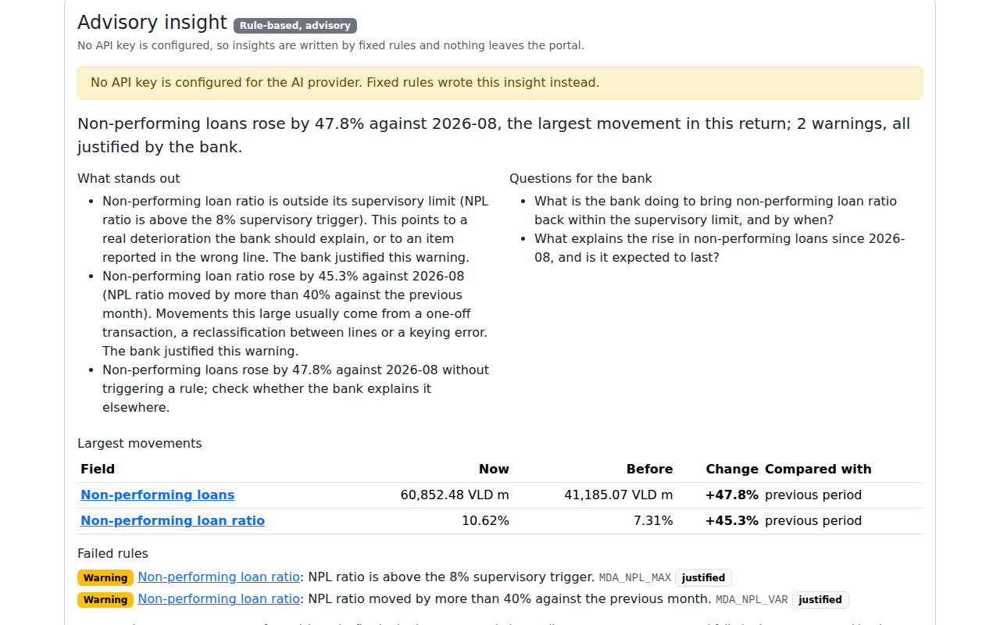
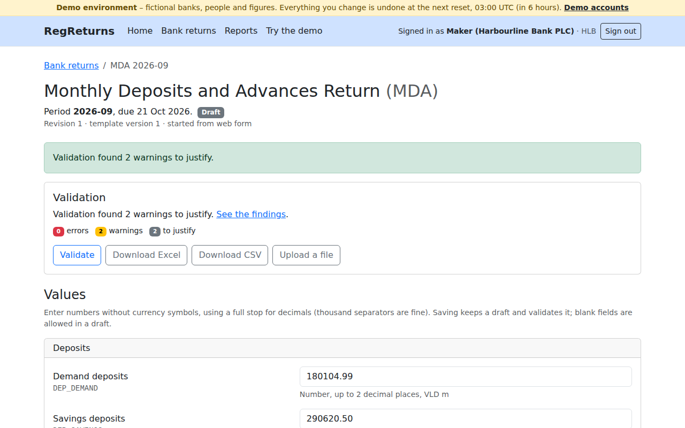
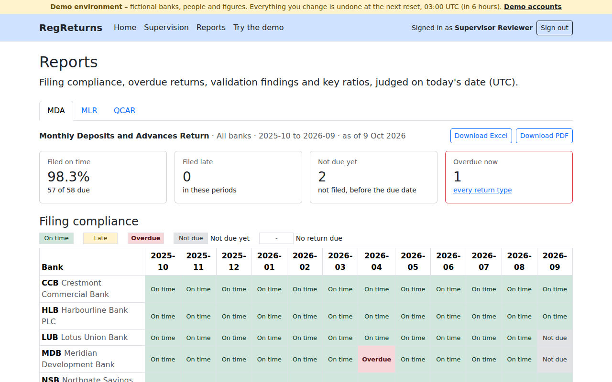
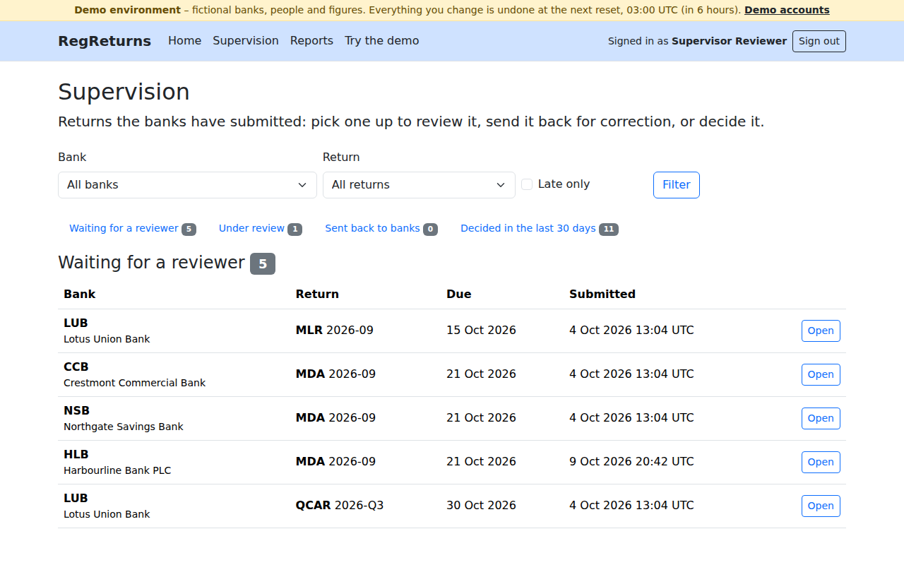
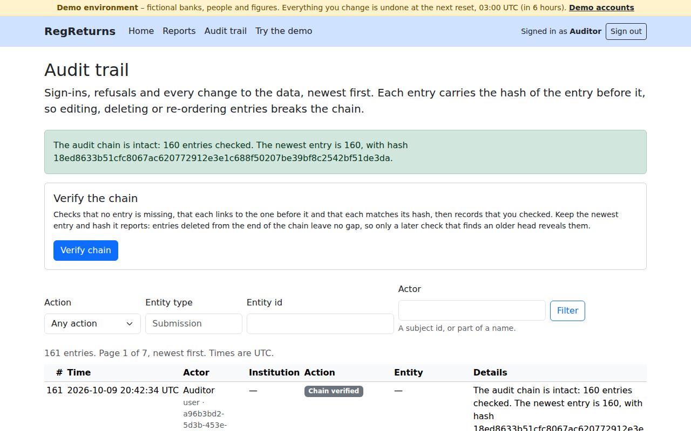
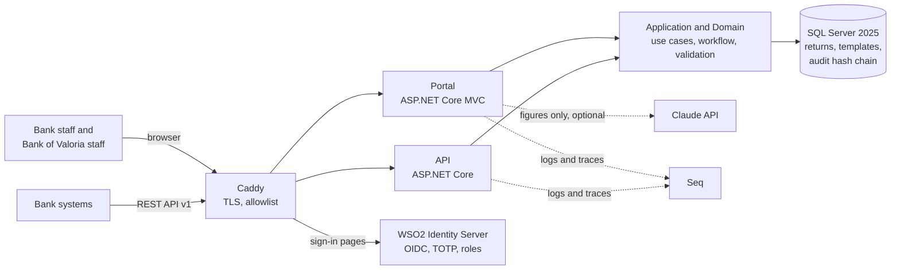

# RegReturns – Regulatory Returns Portal

[](https://github.com/rovindu12/regreturns-portal/actions/workflows/ci.yml)
[](https://github.com/rovindu12/regreturns-portal/actions/workflows/release.yml)
[](https://github.com/rovindu12/regreturns-portal/actions/workflows/codeql.yml)

RegReturns lets licensed banks submit periodic regulatory returns to a central bank, validates them against
configurable rules, routes them through a maker-checker and supervisory review workflow with a tamper-evident audit
trail, and tracks who files on time on dashboards. WSO2 Identity Server signs everyone in.

All institutions, people and data are **fictional**. The regulator is the "Bank of Valoria" (currency VLD).

> **Status:** all twelve build phases are complete. The hosted demo goes live once a domain and a server are set up
> ([deployment guide](docs/DEPLOYMENT.md)); until then, run it locally with the [quick start](#quick-start).



| | |
|---|---|
|  |  |
|  |  |

## What it does

- **Returns from banks.** Makers enter figures or upload the bank's Excel or CSV file; a checker justifies every
  warning and submits. Bank systems can deliver the same returns through a versioned REST API with idempotency keys.
- **Rules the regulator owns.** Versioned templates with required, range, cross-field and variance rules, edited in the
  portal; every channel runs the same validation engine.
- **Supervision.** A worklist, review and approval with segregation of duties enforced in the domain, approvals behind
  a one-time code, and an advisory note on each return written by Claude (or by fixed rules) from figures only.
- **Evidence.** Every change, decision, sign-in, export and AI call is in an HMAC hash chain that the auditor can
  verify; the table is append-only at the database.
- **Oversight.** A bank by period compliance grid, overdue returns, findings trends and key ratios, exported to Excel or
  PDF.
- **Migration.** A dry-run-first migrator moves the legacy system's CSV exports in, and commits only when the totals
  reconcile.

## Roles

| Role | WSO2 role | What they do | One-time code | Demo account |
|---|---|---|---|---|
| Bank maker | `bank_maker` | Prepares, uploads and validates their bank's returns; never submits | No | `maker.hlb` (and `.ccb`, `.lub`, `.nsb`, `.mdb`) |
| Bank checker | `bank_checker` | Justifies warnings and submits a return they did not prepare or last edit | No | `checker.hlb` (and the other banks) |
| Supervision reviewer | `supervisor_reviewer` | Starts reviews, asks for advisory insights, returns returns for correction | No | `reviewer` |
| Supervision approver | `supervisor_approver` | Approves or rejects; never a return they reviewed | Yes | `approver.mfa` (always), `approver` |
| Auditor | `auditor` | Reads the audit trail and verifies its hash chain | No | `auditor` |
| System administrator | `portal_admin` | Templates and rules, people's access, authenticator resets, diagnostics, the demo reset | Yes | `admin.demo` |
| Bank system | API client | Reads reference data and its bank's returns, delivers returns as drafts | n/a | The read-only demo client |

Everyone can open **Reports**. The demo accounts share one password, shown on the demo page with the authenticator keys
of the accounts that need a one-time code ([demo guide](docs/DEMO.md), [identity and access](docs/IAM.md)).

## Architecture at a glance



Clean architecture (Domain ← Application ← Infrastructure ← hosts, enforced by tests); the portal and the API share
one set of use cases and never call each other. The C4 diagrams, the data model and the life of a return are in
[docs/ARCHITECTURE.md](docs/ARCHITECTURE.md).

## Quick start

Needs the .NET 10 SDK, Docker, openssl and jq.

```bash
scripts/init-env.sh             # .env with random secrets (never copy .env.example: its values are public)
scripts/dev-certs.sh            # development CA, WSO2 keystores and SQL Server's certificate
docker compose up -d            # SQL Server, WSO2 Identity Server, Seq
scripts/dev-secrets.sh          # secrets into dotnet user-secrets
dotnet run --project tools/RegReturns.Migrator -- migrate-db --seed
dotnet run --project tools/RegReturns.IamBootstrap -- apply
scripts/dev-secrets.sh          # again, for the portal's client secret
dotnet run --project src/RegReturns.Web    # https://localhost:7101
dotnet run --project src/RegReturns.Api    # https://localhost:7201/swagger
```

Open https://localhost:7101/demo for every demo account with a *Sign in as* button, the shared password and the
authenticator keys, and https://localhost:7101/demo/guide for the guided tour that takes one return from draft to
approval. Logs and traces are at http://localhost:8081. More commands are in [CLAUDE.md](CLAUDE.md#commands).

`scripts/demo-scenario.sh --reset` plays the whole tour in a headless browser, checks every page against WCAG 2.2 AA
with axe and fails on any Content Security Policy violation; `--screenshots` refreshes the pictures in this README.

## Features in more depth

- **API for bank systems.** OAuth 2.0 client credentials from WSO2, one client per bank; `POST /v1/submissions`
  delivers a whole return as a draft and answers with the validation findings; idempotency keys, paging, rate limits
  and problem answers with stable codes. Swagger UI signs in with the demo client. See [docs/API.md](docs/API.md).
- **Reports.** For each return type: the share filed on time, a bank by period grid, every overdue return, findings by
  rule and key ratios such as the LCR, NPL ratio and capital adequacy ratio. Bank staff see their own bank only;
  every export is audited ([ADR 0028](docs/adr/0028-reporting-views-and-exports.md)).
- **Legacy migration.** `regreturns-migrator legacy` cleans dates, amounts and bank names through a JSON mapping,
  checks every row with the portal's rules and commits only when the stored figures reconcile with the source. Try it
  on the generated samples, which document their planted defects ([data migration guide](docs/DATA-MIGRATION.md)):

  ```bash
  dotnet run --project tools/RegReturns.Migrator -- legacy --source samples/legacy --dry-run --report out/legacy
  ```

- **Advisory insights.** Movements and failed rules are computed in code; Claude writes only the headline,
  observations and questions, from figures, codes and the regulator's template text, never the bank's name or anything
  a bank typed. Without `ANTHROPIC_API_KEY`, or when a call fails, fixed rules write the note. Every generation is
  audited with digests of what was sent and written ([guide](docs/AI-ASSISTANT.md)).
- **Security.** A strict Content Security Policy with a nonce per response, anti-forgery on every form, TLS to SQL
  Server that every client pins, account lock in WSO2, one-time codes for approvals and administration, a least
  privilege database login and an edge that exposes only WSO2's sign-in pages. Threat model, ASVS self-assessment and
  how each control is tested: [docs/SECURITY.md](docs/SECURITY.md).
- **Accessibility.** WCAG 2.2 AA, checked with axe on every page of the browser tour in the release pipeline
  ([ADR 0035](docs/adr/0035-documentation-and-accessibility-checks.md)).
- **Deployment.** One server with Docker Compose behind Caddy: chiselled, non-root images, SBOMs and Trivy, the whole
  production stack driven through a browser and backed up and restored on every pull request, and deploys over an SSH
  key that can run one command ([deployment](docs/DEPLOYMENT.md), [disaster recovery](docs/DR-RUNBOOK.md)).
- **Observability.** One W3C trace id in every log line, trace, error page and API problem answer, searchable in Seq;
  a troubleshooting guide organised by symptom ([docs/TROUBLESHOOTING.md](docs/TROUBLESHOOTING.md)).

## Tech stack

.NET 10 · ASP.NET Core MVC and Web API · EF Core 10 · SQL Server 2025 · WSO2 Identity Server 7.3 · Serilog ·
OpenTelemetry · Seq · Dapper · ClosedXML · QuestPDF · Chart.js · Bootstrap 5 · Anthropic SDK · Cronos · QRCoder ·
Mermaid · xUnit v3 · Testcontainers · Playwright · axe-core · Docker · Caddy · GitHub Actions · CodeQL · Trivy ·
gitleaks · ShellCheck.

## Documentation

| Document | For |
|---|---|
| [User guide](docs/USER-GUIDE.md) | Using the portal, role by role, with screenshots |
| [Demo guide](docs/DEMO.md) | The public demo: accounts, the story in the data, the guided tour, the reset |
| [Architecture](docs/ARCHITECTURE.md) | C4 context, container and component diagrams, data model, workflow |
| [Identity and access](docs/IAM.md) | WSO2 setup, roles, claims, sign-in, MFA, API clients |
| [API guide](docs/API.md) | Calling the API from a bank system |
| [Security](docs/SECURITY.md) | Threat model, controls and how they are tested |
| [Deployment](docs/DEPLOYMENT.md) · [Disaster recovery](docs/DR-RUNBOOK.md) | Running the stack on a server, backups and restore |
| [Troubleshooting](docs/TROUBLESHOOTING.md) | Symptoms, causes and fixes, with log event ids |
| [Data migration](docs/DATA-MIGRATION.md) · [Advisory insights](docs/AI-ASSISTANT.md) | The legacy migrator; the AI assistant |
| [Backlog](docs/BACKLOG.md) · [Implementation plan](docs/IMPLEMENTATION-PLAN.md) | User stories by sprint and what is next; the original plan |
| [Architecture decisions](docs/adr/README.md) | Why each choice was made (35 ADRs) |
| [Contributing](CONTRIBUTING.md) · [Changelog](CHANGELOG.md) | Conventions for changes; what changed |

## Licence

[MIT](LICENSE)
