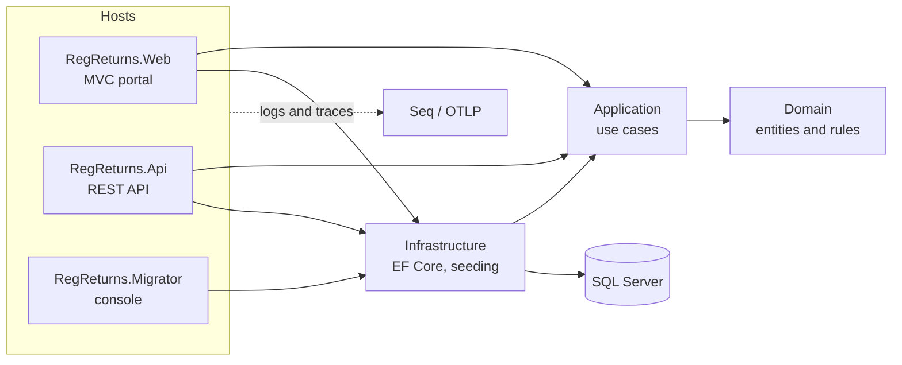

# RegReturns – Regulatory Returns Portal

> **Status:** under active development (phase 1 of 12 complete). Live demo link, screenshots and the full
> documentation set arrive in later phases.

RegReturns lets licensed banks submit periodic regulatory returns to a central bank, validates them against
configurable rules, routes them through a maker-checker and supervisory review workflow, and tracks compliance on
dashboards. Identity and access are managed centrally by WSO2 Identity Server.

All institutions, people and data are **fictional**. The regulator in the demo is the "Bank of Valoria".

## Architecture at a glance



## Quick start

```bash
cp .env.example .env            # set MSSQL_SA_PASSWORD
docker compose up -d            # SQL Server + Seq
export ConnectionStrings__RegReturns="Server=localhost,1433;Database=RegReturns;User Id=sa;Password=<pw>;TrustServerCertificate=True"
dotnet run --project tools/RegReturns.Migrator -- migrate-db --seed
dotnet run --project src/RegReturns.Web
```

Open https://localhost:7101, and http://localhost:8081 for logs and traces.

## Tech stack

.NET 10 · ASP.NET Core MVC and Web API · EF Core 10 · SQL Server 2025 · Serilog · OpenTelemetry · Seq ·
xUnit v3 · Testcontainers · GitHub Actions. WSO2 Identity Server 7.3, Chart.js and Docker deployment come in later phases.

## Documentation

- [Implementation plan](docs/IMPLEMENTATION-PLAN.md)
- [Architecture decision records](docs/adr)
- [Troubleshooting](docs/TROUBLESHOOTING.md)
- [Contributing](CONTRIBUTING.md) · [Changelog](CHANGELOG.md)

## Licence

[MIT](LICENSE)
