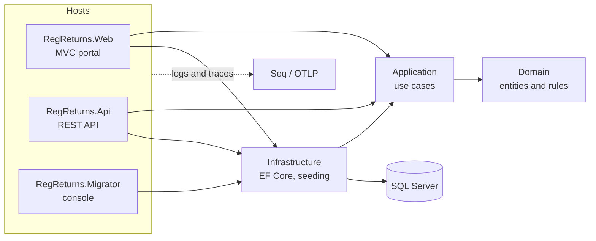

# RegReturns – Regulatory Returns Portal

> **Status:** under active development (phase 7 of 12 complete). Live demo link, screenshots and the full
> documentation set arrive in later phases.

RegReturns lets licensed banks submit periodic regulatory returns to a central bank, validates them against
configurable rules, routes them through a maker-checker and supervisory review workflow, and tracks compliance on
dashboards. Identity and access are managed centrally by WSO2 Identity Server.

All institutions, people and data are **fictional**. The regulator in the demo is the "Bank of Valoria".

## Architecture at a glance



## Quick start

Needs the .NET 10 SDK, Docker, openssl and jq.

```bash
scripts/init-env.sh             # .env with random secrets (never copy .env.example: its values are public)
scripts/dev-certs.sh            # development CA and WSO2 keystores
docker compose up -d            # SQL Server, WSO2 Identity Server, Seq
scripts/dev-secrets.sh          # secrets into dotnet user-secrets
dotnet run --project tools/RegReturns.Migrator -- migrate-db --seed
dotnet run --project tools/RegReturns.IamBootstrap -- apply
scripts/dev-secrets.sh          # again, for the portal's client secret
dotnet run --project src/RegReturns.Web
```

Open https://localhost:7101, and http://localhost:8081 for logs and traces. Demo users sign in with
`DEMO_USER_PASSWORD` from `.env`; approvers and the administrator also need the TOTP code from their secret in
`.env.generated`. More commands are in [CLAUDE.md](CLAUDE.md#commands).

## API for bank systems

```bash
dotnet run --project src/RegReturns.Api   # https://localhost:7201/swagger
```

Swagger UI signs in with client credentials: choose **Authorize** and enter `DEMO_API_CLIENT_SECRET` from
`.env.generated` for the read-only demo client. Each bank's own client (`BANK_<CODE>_CLIENT_ID` and `_SECRET`) can
also deliver a return with `POST /v1/submissions` and an `Idempotency-Key`; the return arrives as a draft that a bank
checker submits in the portal ([ADR 0026](docs/adr/0026-api-delivers-drafts-through-a-client-user.md),
[ADR 0027](docs/adr/0027-web-api-v1-conventions.md)).

## Reports

The **Reports** area (every role) shows, for one return type at a time, a bank × period compliance grid (on time,
late, overdue, not due yet), every overdue return, the trend of validation findings by rule, and sparklines of key
ratios such as the LCR, NPL ratio and capital adequacy ratio. Bank staff see their own bank only. The compliance
report downloads as Excel or PDF, and every download is recorded in the audit trail
([ADR 0028](docs/adr/0028-reporting-views-and-exports.md)).

## Migrating legacy returns

`regreturns-migrator legacy` moves filed returns from the old returns system's CSV exports into the portal. A JSON
mapping cleans dates, amounts and bank names; every row is checked with the same rules as the portal; and the run
commits only when the stored figures reconcile with the source, by bank, period and field. A dry run shows the
result first. Try it on the generated sample exports, which have their defects documented in
[samples/legacy](samples/legacy/README.md):

```bash
dotnet run --project tools/RegReturns.Migrator -- legacy --source samples/legacy --dry-run --report out/legacy
```

See the [data migration guide](docs/DATA-MIGRATION.md) and [ADR 0029](docs/adr/0029-legacy-data-migration.md).

## Tech stack

.NET 10 · ASP.NET Core MVC and Web API · EF Core 10 · SQL Server 2025 · Serilog · OpenTelemetry · Seq ·
Dapper · ClosedXML · QuestPDF · Chart.js · xUnit v3 · Testcontainers · GitHub Actions · WSO2 Identity Server 7.3.
Docker deployment comes in a later phase.

## Documentation

- [Implementation plan](docs/IMPLEMENTATION-PLAN.md)
- [Architecture decision records](docs/adr)
- [Troubleshooting](docs/TROUBLESHOOTING.md)
- [Data migration guide](docs/DATA-MIGRATION.md)
- [Contributing](CONTRIBUTING.md) · [Changelog](CHANGELOG.md)

## Licence

[MIT](LICENSE)
