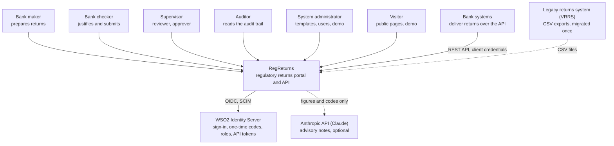
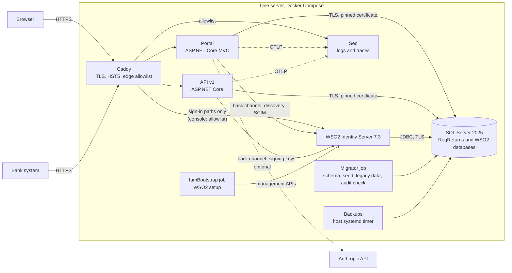
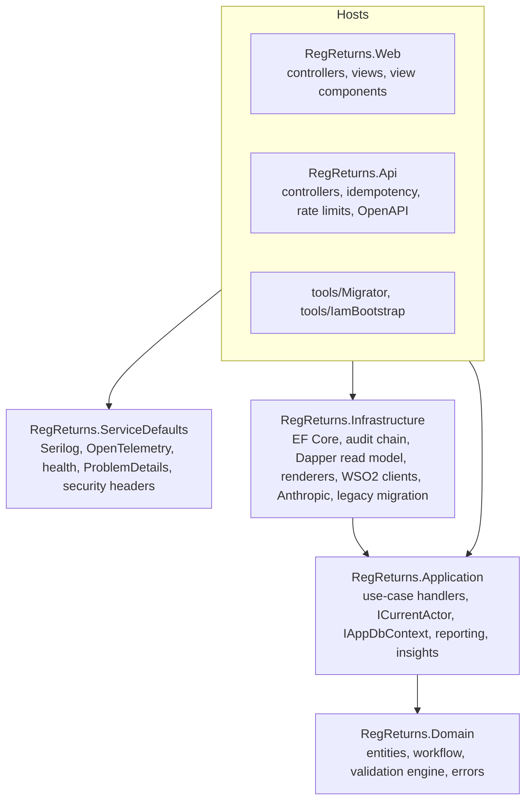
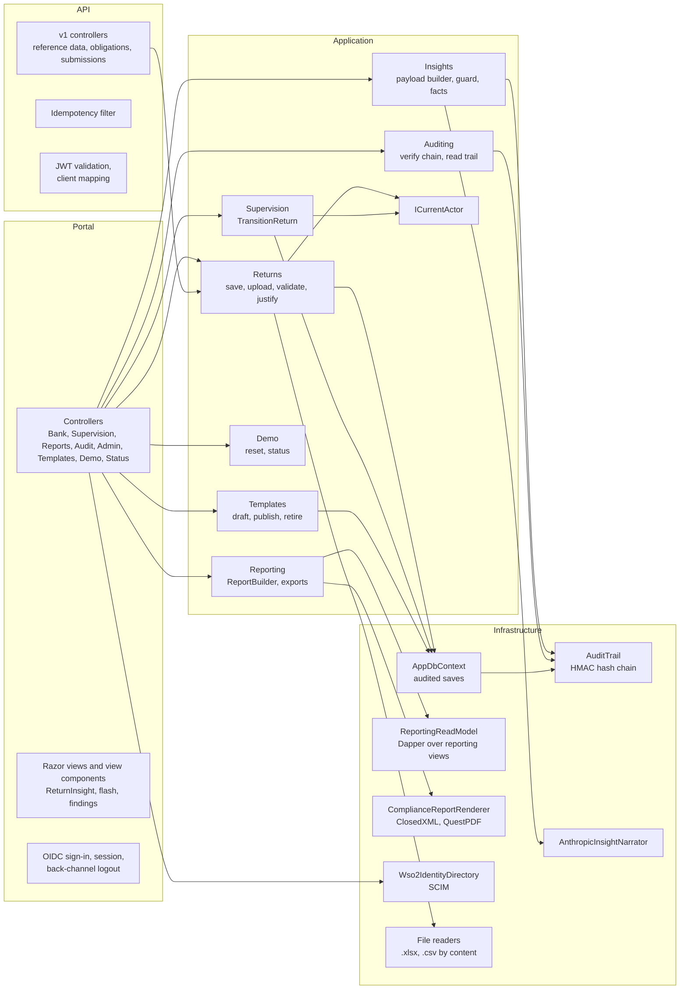
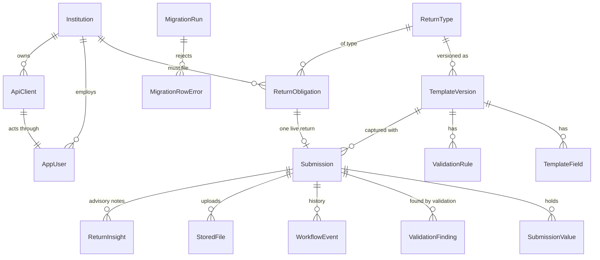
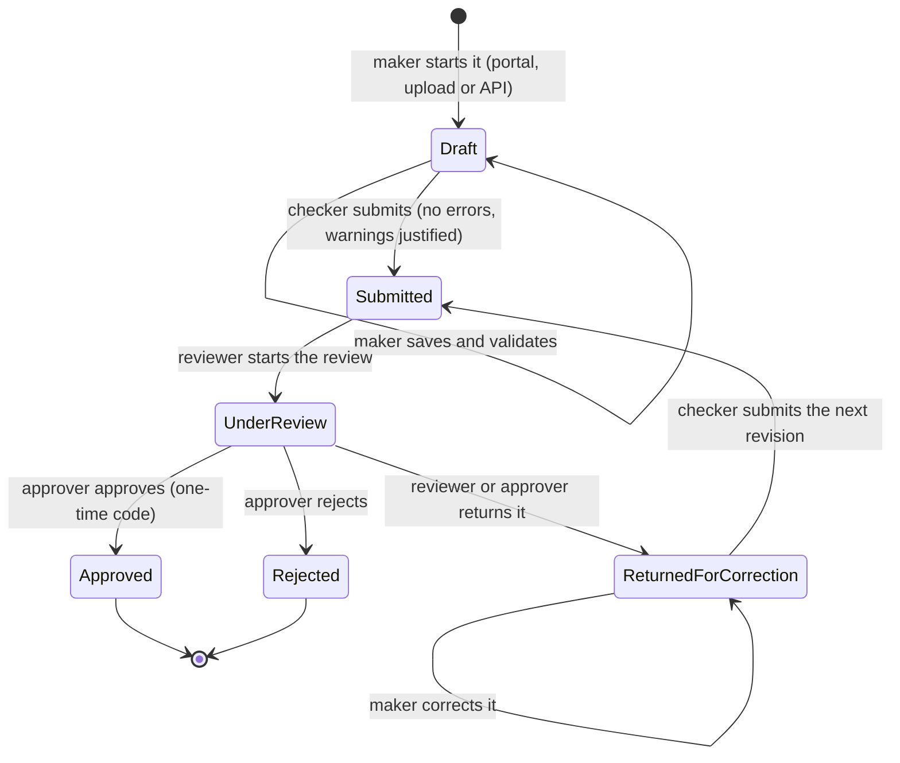
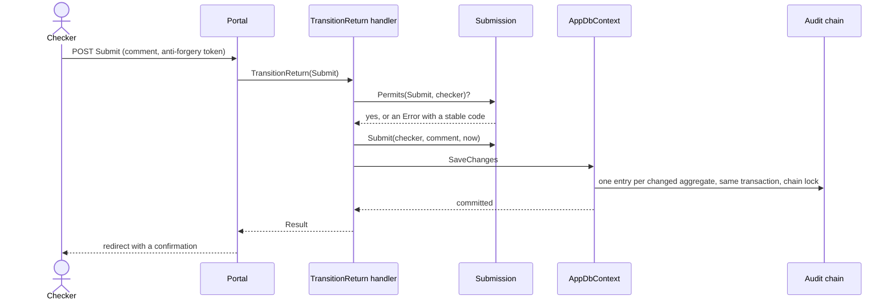
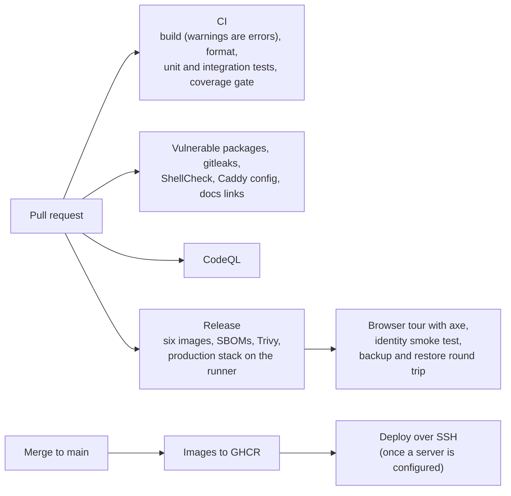

# Architecture

How RegReturns is built, from the outside in: the system and the people around it, the containers that run it, the
components inside the portal and the API, the data they keep and the rules that hold it together. The diagrams follow
the [C4 model](https://c4model.com) (context, containers, components) and are drawn in Mermaid so they live and change
with the code. Why each choice was made is in the [architecture decision records](adr/README.md); the plan the build
followed is in [IMPLEMENTATION-PLAN.md](IMPLEMENTATION-PLAN.md).

All institutions and people are fictional. The regulator is the **Bank of Valoria**; figures are in VLD millions.

## 1. System context

Banks file periodic returns with the regulator. Bank staff prepare and submit them in the portal (or a bank's own
system delivers them through the API); the regulator's staff review, approve or return them and watch who files on
time. WSO2 Identity Server signs everyone in. Claude, through the Anthropic API, can write an advisory note on a
return; without it, fixed rules write the note.

| Who | What they do | Where |
|---|---|---|
| Bank maker | Prepares a return by hand or by upload, validates it | Portal, *Bank returns* |
| Bank checker | Justifies warnings and submits; never the person who prepared or last edited the return | Portal, *Bank returns* |
| Supervision reviewer | Starts the review, asks for an advisory insight, returns a return for correction | Portal, *Supervision* |
| Supervision approver | Approves or rejects after a one-time code; never the reviewer of the same return | Portal, *Supervision* |
| Auditor | Reads the audit trail and verifies its hash chain | Portal, *Audit trail* |
| System administrator | Templates and rules, users' access, the demo reset, diagnostics | Portal, *Administration* |
| Bank system | Reads reference data and its bank's returns, delivers a return as a draft | API v1 |

The full role mapping, with the WSO2 roles and the policies behind each area, is in [IAM.md](IAM.md).

## 2. Containers

Everything runs on one server with Docker Compose ([DEPLOYMENT.md](DEPLOYMENT.md), [ADR 0034](adr/0034-containers-release-pipeline-and-hosting.md)).
Only Caddy is reachable from the internet. The portal and the API are separate processes over the same database and
the same use cases: the portal does not call the API.

| Container | Technology | Responsibility |
|---|---|---|
| Caddy | Caddy 2 | Terminates TLS, adds HSTS, exposes WSO2's sign-in paths only and keeps its console and Seq behind an IP allowlist |
| Portal (`web`) | ASP.NET Core MVC, Razor, Bootstrap 5, Chart.js | Every screen for every role, OIDC sign-in, exports, the demo pages and the nightly demo reset |
| API (`api`) | ASP.NET Core Web API, Asp.Versioning, Swashbuckle | Reference data, a bank's returns and draft delivery for bank systems; idempotency and rate limits |
| SQL Server | SQL Server 2025 Express | The `RegReturns` database (seven schemas) and WSO2's three databases; forced TLS |
| WSO2 Identity Server | WSO2 IS 7.3 | Users, roles, OIDC and OAuth 2.0, TOTP, account lock, SCIM |
| Seq | Seq | Structured logs and traces from every host, searchable by trace id |
| Migrator | .NET console | `migrate-db [--seed]`, `legacy` migration, `verify-audit`; runs as a job on every deploy |
| IamBootstrap | .NET console | Creates and updates everything in WSO2 through its REST APIs; runs as a job on every deploy |
| Backups | `deploy/regreturns.sh backup` on a timer | Verified full backups of the four databases; optionally an encrypted copy off the server with the keys needed to use them |

Every image is a chiselled, non-root .NET image; health checks call the app's own binary
(`--health-probe`, there is no shell). The trust between containers is explicit: the apps pin SQL Server's certificate
and trust the development or deployment CA for WSO2 by configuration, never by turning validation off
([ADR 0015](adr/0015-explicit-trust-for-the-dev-ca.md), [ADR 0033](adr/0033-security-hardening.md)).

## 3. Components

### Layers

The dependency rule is Domain ← Application ← Infrastructure ← hosts. The Domain has no package dependencies; the
Application references EF Core abstractions only. Architecture tests in
[tests/RegReturns.UnitTests/Architecture](../tests/RegReturns.UnitTests/Architecture) fail the build when a reference
points the wrong way or a controller touches the database context ([ADR 0002](adr/0002-clean-architecture-with-service-defaults.md)).
Handlers are plain classes registered by scanning, with no mediator library ([ADR 0003](adr/0003-plain-handlers-instead-of-mediatr.md)).

### Inside the portal and the API

A controller resolves one handler per action (`[FromServices]`) and never touches the database. Each handler finds the
caller with `ICurrentActor`, which reads the user record linked to the WSO2 subject (roles come from that record, not
from token claims), and scopes bank data to the caller's institution: another bank's ids answer 404.

## 4. Data

One database, seven schemas: `reference` (institutions, return types, templates and rules), `iam` (users and API
clients), `returns` (obligations, submissions and everything hanging off them), `audit` (the append-only chain), `api`
(idempotency records), `reporting` (views only) and `migration` (legacy runs and row errors).

- **Templates are versioned** ([ADR 0009](adr/0009-versioned-templates.md)). A return is captured with the published
  version in force at its period start; editing a template means a new draft version, and retiring is explicit.
- **Values are a narrow table** (one row per field) so a template can change without a schema change
  ([ADR 0007](adr/0007-submission-values-narrow-table.md)).
- **One live return per obligation**, enforced by a filtered unique index; a rejected return frees the obligation
  ([ADR 0023](adr/0023-one-live-return-per-obligation.md)).
- **Ids are GUID v7**, assigned by the domain ([ADR 0005](adr/0005-domain-assigned-guid-v7-keys.md)).
- The dashboards read SQL views in the `reporting` schema with Dapper; the views are not in the EF model
  ([ADR 0028](adr/0028-reporting-views-and-exports.md)).

## 5. The life of a return

The rules live in one place: `Submission.Permits(action, actor)` checks state, role, organisation and segregation of
duties, and `ActionsFor(actor)` lists the steps a page may offer, so a button the user cannot use is never shown
([src/RegReturns.Domain/Submissions/Submission.cs](../src/RegReturns.Domain/Submissions/Submission.cs),
[ADR 0025](adr/0025-workflow-steps-and-supervision-visibility.md)). Submitting needs values, a validation run after the
last edit, no errors and a justification of at least 20 characters for each warning. Returning for correction starts a
new revision; the first submission after the due date marks the return late. Regulator staff see a return only once it
has been submitted.

Validation is a pure engine over the template's rules: required fields, data types, ranges, cross-field expressions
in a small in-house language, and variance against the approved figure of the previous period or the same period last year
([ValidationEngine.cs](../src/RegReturns.Domain/Validation/ValidationEngine.cs), [ADR 0021](adr/0021-in-house-rule-expressions.md)).
Every channel (form, upload, API, legacy migration) parses values with the same `FieldValueParser` and runs the same
engine.

## 6. Cross-cutting concerns

| Concern | How | Where to read more |
|---|---|---|
| Audit | Every save in a host records one entry per changed aggregate in the same transaction, chained with HMAC-SHA256; a trigger makes the table append-only; the auditor and the migrator verify the chain | [ADR 0016](adr/0016-hash-chained-audit-trail.md), [ADR 0024](adr/0024-auditing-data-changes.md) |
| Identity | WSO2 is the only identity store; the portal uses the authorization code flow with PKCE, the API validates client-credentials tokens; approvals and administration need a one-time code | [IAM.md](IAM.md) |
| Errors | Expected failures are `Result`/`Error` values with stable codes; the API answers `application/problem+json` with the code and the trace id | [ADR 0006](adr/0006-result-type-for-expected-failures.md), [API.md](API.md) |
| Observability | Serilog and OpenTelemetry into Seq; one W3C trace id in every log line, problem answer, error page and `X-Trace-Id` header; event ids grouped by area | [ADR 0010](adr/0010-observability-serilog-opentelemetry-seq.md), [TROUBLESHOOTING.md](TROUBLESHOOTING.md) |
| Security | Strict CSP with a nonce per response, anti-forgery on every form, forced and pinned TLS to SQL Server, safe uploads, a least-privilege database login | [SECURITY.md](SECURITY.md) |
| Accessibility | WCAG 2.2 AA, checked with axe on every page of the browser tour | [ADR 0035](adr/0035-documentation-and-accessibility-checks.md) |
| Configuration | Options classes validated at start; secrets only in user-secrets or environment variables | [CLAUDE.md](../CLAUDE.md#conventions) |
| AI | Only figures, codes and template text leave the system; computed facts in code, narrative from the model, rule-based fallback; every call audited | [AI-ASSISTANT.md](AI-ASSISTANT.md), [ADR 0030](adr/0030-advisory-return-insights.md) |

## 7. Build, test and release

Unit tests cover the domain, validation, seeding, redaction and architecture rules; integration tests run the hosts
with `WebApplicationFactory` against SQL Server in Testcontainers, with the same forced TLS as production
([ADR 0011](adr/0011-testing-platform-and-coverage.md)). The Release workflow deploys the production compose file on the
runner and drives it through a browser before any image is pushed.
