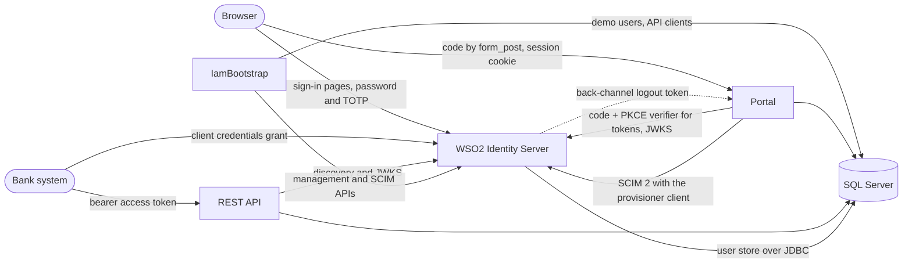
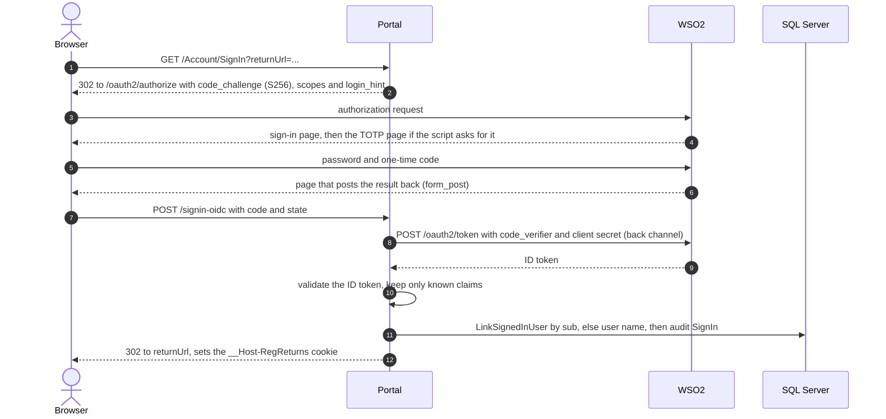

# Identity and access management

WSO2 Identity Server 7.3 is the only identity store: people and bank systems authenticate there, and the portal and
the API never see or store a password. Every object RegReturns needs in WSO2 is created and kept in line by
IamBootstrap, never by hand in the Console ([ADR 0017](adr/0017-iam-bootstrap.md)).

## Overview



On a server, browsers and bank systems come in through Caddy; every arrow from an app or IamBootstrap to WSO2 is the
back channel ([ADR 0015](adr/0015-explicit-trust-for-the-dev-ca.md)). WSO2 keeps users in its own databases
([ADR 0014](adr/0014-wso2-on-sql-server.md)); RegReturns keeps projections in `iam.Users` and `iam.ApiClients`.

## What IamBootstrap creates

`tools/RegReturns.IamBootstrap` runs these steps in order. Each object is looked up by a stable name, created when
missing and updated when different, so a second run reports no changes; apps are never deleted and recreated.

| Step | What it creates or changes |
|---|---|
| `claims` | Local claim `http://wso2.org/claims/institution_id` (read-only for users), OIDC claim `institution_id`, SCIM attributes `institutionId` and `fullName` in `urn:scim:schemas:extension:custom:User`, and the `institution` OIDC scope; local claim `http://wso2.org/claims/totp_enrolment_until` and its SCIM attribute `totpEnrolmentUntil`, never released in tokens |
| `api-resource` | API resource *RegReturns API*, identifier `https://api.regreturns`, scopes `returns:read`, `returns:submit` and `reference:read` (scopes are only ever added) |
| `portal-app` | OIDC app *RegReturns Portal* (`regreturns-portal`): confidential client, code flow only, PKCE S256 mandatory, JWT access tokens of 300 seconds, redirect `/signin-oidc` and `/signout-callback-oidc`, back-channel logout URL, no consent screens, the claims the portal reads, `sub` set to the WSO2 user id, and a two-step sequence (password, TOTP) with the adaptive script |
| `roles` | The six application roles, with the portal app as their audience |
| `api-clients` | One client-credentials app per active bank and the read-only demo client, each authorised for the API resource; their rows in `iam.ApiClients` and the client user each acts through |
| `provisioner` | Client-credentials app *RegReturns Provisioner* (`regreturns-provisioner`), authorised on WSO2's `/scim2/Users` system API for exactly the scopes the portal requests (list, view, update); an authorisation on `/scim2/Roles` left by an earlier version is withdrawn |
| `self-service` | When `IamBootstrap:LockDownSelfService` is on: self-registration, lite registration, account recovery and TOTP enrolment during sign-in off, and WSO2's My Account app disabled |
| `account-lock` | WSO2's account lock handler on, with the configured attempts and lock time |
| `demo-users` | A WSO2 user for every demo `AppUser` row (e-mail, full name, institution, role memberships) and the link from each row to its WSO2 user id |
| `demo-totp` | TOTP pre-enrolment for every demo user who reaches the TOTP step |

Run it from the repository root once WSO2 is up and the database is migrated and seeded:

```bash
dotnet run --project tools/RegReturns.IamBootstrap -- apply        # every step
dotnet run --project tools/RegReturns.IamBootstrap -- demo-users   # demo-users and demo-totp only, passwords reset
scripts/dev-secrets.sh                                             # copies the new client secrets into user-secrets
```

`apply` sets a demo user's password only when it creates the user; `demo-users` resets every demo user's password,
e-mail, name, institution and roles, and enrols a new TOTP secret only if the known one no longer works. On a server,
`deploy/regreturns.sh deploy` runs `apply` and a nightly timer runs `deploy/regreturns.sh demo-users`
([DEPLOYMENT.md](DEPLOYMENT.md)). The tool reads `WSO2_ADMIN_USERNAME`, `WSO2_ADMIN_PASSWORD`, `DEMO_USER_PASSWORD`
and an optional `WSO2_HOSTNAME` from `./.env` (real environment variables win) and the database through
`ConnectionStrings:RegReturns`. It writes generated secrets to `.env.generated` (`IamBootstrap:EnvFilePath` or
`--env-file`; git-ignored, owner-only, other keys kept):

| Key | Step | Used by |
|---|---|---|
| `Oidc__ClientId`, `Oidc__ClientSecret` | `portal-app` | The portal (`Oidc:*`) |
| `BANK_<CODE>_CLIENT_ID`, `BANK_<CODE>_CLIENT_SECRET` | `api-clients` | That bank's system |
| `DEMO_API_CLIENT_ID`, `DEMO_API_CLIENT_SECRET` | `api-clients` | The demo page and Swagger UI (`Demo:ApiClientId`, `Demo:ApiClientSecret`) |
| `PROVISIONER_CLIENT_ID`, `PROVISIONER_CLIENT_SECRET` | `provisioner` | The portal (`Iam:Provisioner:*`) |
| `TOTP_SECRET_<USER>` | `demo-totp` | The demo page (`Demo:TotpSecrets:<USER>`) and the smoke tests |

## Roles

| WSO2 role (`RoleNames`) | Held by | In the portal | One-time code |
|---|---|---|---|
| `bank_maker` | Bank staff | *Bank returns*: start drafts, edit values, upload files, validate, justify warnings; *Reports* for their bank | No |
| `bank_checker` | Bank staff | *Bank returns*: validate, justify warnings, submit; *Reports* for their bank | No |
| `supervisor_reviewer` | Regulator staff | *Supervision*: start a review, return for correction, generate an insight; *Reports* | No |
| `supervisor_approver` | Regulator staff | *Supervision*: approve, reject, return for correction, generate an insight; *Reports* | Yes, when MFA is enforced |
| `portal_admin` | Regulator staff | *Administration*: templates, people and API clients, authenticator resets, diagnostics, demo reset; *Audit trail*; *Reports* | Yes, when MFA is enforced |
| `auditor` | Regulator staff | *Audit trail*: read it and verify the hash chain; *Reports* | No |

Other role values are dropped at sign-in. `portal_admin` is not `system_admin` because WSO2 rejects role names
starting with `system_`. `AppUser` requires at least one role, bank roles only with an institution, regulator roles
only without one, and never both kinds together (`User.MixedRoles`). One person may hold maker and checker, or
reviewer and approver; the rules below still apply.

### Segregation of duties

Endpoint policies are a first filter; the domain decides. `Submission.Permits(action, actor)` in
[Submission.cs](../src/RegReturns.Domain/Submissions/Submission.cs) checks state, role, organisation and segregation
of duties in one place, `ActionsFor(actor)` lists the steps a page may offer, and every step runs through
[TransitionReturn](../src/RegReturns.Application/Returns/TransitionReturn.cs)
([ADR 0025](adr/0025-workflow-steps-and-supervision-visibility.md)).

| Step | Who | Segregation rule |
|---|---|---|
| Create a draft, edit values | Bank maker of the return's bank (`Submission.WrongInstitution` otherwise) | |
| Submit | Bank checker of the return's bank | Not the preparer and not the last editor (`Submission.CheckerIsMaker`) |
| Start review | Supervisor reviewer, regulator staff (`Submission.RegulatorOnly` otherwise) | |
| Return for correction | Supervisor reviewer or approver, regulator staff | |
| Approve, reject | Supervisor approver, regulator staff | Not the person who started the current review (`Submission.ApproverIsReviewer`) |

Saving unchanged values is not an edit, so it does not make the saver the last editor. Returning for correction
clears the reviewer, so the next revision is reviewed afresh.

## Claims and scopes

The portal requests the scopes `openid profile email roles institution` (`OidcScopes`) and never `internal_login`,
which would open WSO2's self-service APIs. Inbound claim mapping is off, the UserInfo endpoint is not called, and
`PortalClaims` keeps only these claims of the ID token in the session cookie (names in `ClaimNames`):

| Claim | Meaning |
|---|---|
| `sub` | The WSO2 user id (the app's subject claim is `http://wso2.org/claims/userid`), stable across user name changes |
| `username`, `name`, `email` | User name; display name (`name`, else given and family name, else the user name); e-mail |
| `roles` | Known application roles only |
| `institution_id` | The bank's `Institution.Code`; absent for regulator staff |
| `amr`, `sid` | Authentication methods, which prove the TOTP step; the WSO2 session id, for back-channel logout |

Roles reach the portal's tokens because their audience is the portal app; a role of any other audience never does.
`roles` is a plain string for one role and an array for several, and `PortalClaims.SplitRoles` accepts both.
`institution_id` is released only through the custom `institution` scope. The API's scopes (`ApiScopes`):

| Scope | Allows | Endpoints |
|---|---|---|
| `returns:read` | Read the calling bank's returns and their status | `GET /v1/submissions`, `GET /v1/submissions/{id}`, `GET /v1/submissions/{id}/validation` |
| `returns:submit` | Deliver a return as a draft that a bank checker submits in the portal ([ADR 0026](adr/0026-api-delivers-drafts-through-a-client-user.md)) | `POST /v1/submissions` |
| `reference:read` | Read the caller's own institution and the return types | `GET /v1/me`, `GET /v1/institutions/{code}`, `GET /v1/return-types`, `GET /v1/return-types/{code}/template` |

## Signing in to the portal



- `returnUrl` must be local. The optional `user` parameter becomes `login_hint` only if it looks like a user name
  (the demo page's *Sign in as* buttons). Pushed authorization is off (`Oidc:UsePushedAuthorization`).
- The ID token must come from `<Wso2:Authority>oauth2/token` for `Oidc:ClientId` and carry `sub`, `username` and
  `sid`. The access token is not kept; the ID token is kept in the cookie ticket for `id_token_hint` at sign-out.
- [LinkSignedInUser](../src/RegReturns.Application/Identity/LinkSignedInUser.cs) finds the `AppUser` by WSO2 subject
  id, else by user name, and creates one from the token if there is none. Name, e-mail and roles follow the token;
  institution and status are RegReturns' own. Sign-in is refused for an institution other than the one on record
  (`User.InstitutionChanged`), an unknown or inactive one, a disabled user, an API client or system account, or a
  record linked to another WSO2 id (`User.IdentityConflict`; demo accounts are relinked, as resets re-create them).
- A refusal ends on `/Account/SignInFailed` with the error code, a reference and an `AuthenticationFailed` audit
  entry; a success is a `SignIn` entry with the `amr` values ([ADR 0019](adr/0019-portal-sign-in-and-sessions.md)).

Endpoint policies
([AuthorizationExtensions.cs](../src/RegReturns.Infrastructure/Identity/Authorization/AuthorizationExtensions.cs))
read the role and `institution_id` claims in the cookie. Use cases resolve the caller with `ICurrentActor`: the active
`AppUser` whose `Wso2UserId` is the cookie's `sub`, with roles and institution from that record, never from the
request. Once a person is disabled, their use cases fail with `User.NotLinked`; a role change in WSO2 takes effect at
their next sign-in. A policy refusal shows `/Account/AccessDenied` and writes an `AccessDenied` audit entry.

The session cookie `__Host-RegReturns` is `Secure`, `HttpOnly` and `SameSite=Lax`. It slides for 20 minutes and ends
8 hours after sign-in whatever the activity.

- **Sign-out** (`POST /Account/SignOut`) puts the cookie ticket's id on a deny list, so a copy of the cookie stops
  working, records `SignOut`, and sends the browser to WSO2's end-session endpoint with `id_token_hint`.
- **Back-channel logout**: when a WSO2 session ends, WSO2 posts a `logout_token` to `/signout-backchannel`. A valid
  token (WSO2's signature, the portal as audience, the back-channel event, a `sid`, no `nonce`, at most 5 minutes old)
  puts the `sid` on the deny list (`IDistributedCache`, per instance) and every cookie carrying it is refused. Locally,
  WSO2 in Docker cannot reach the portal's development certificate, so tests cover this path.

## Multi-factor authentication

The portal app's adaptive script ([PortalAppStep.cs](../tools/RegReturns.IamBootstrap/Steps/PortalAppStep.cs))
runs after the password step and asks for TOTP when the user name is in `IamBootstrap:MfaAlwaysUsers` (`approver.mfa`
by default, compared in lower case) or when `IamBootstrap:EnforceMfa` is on and the user holds `supervisor_approver`
or `portal_admin`. IamBootstrap regenerates the script on every `apply`, so edits in the Console are overwritten.

The portal checks again, so the rule holds even if the script drifts. `Supervision.Approve` (approve, reject) and
`Admin.Manage` (all of administration) add `MfaRequirement`: unless `Iam:EnforceMfa` is off, the session's `amr` must
hold one of `Iam:MfaAuthenticationMethods` (`totp` when empty). Keep `IamBootstrap:EnforceMfa` and `Iam:EnforceMfa`
equal: if the portal enforces and WSO2 does not ask, approvers and administrators are refused.

Enrolment during sign-in is off (`self-service` step), so whoever reaches the TOTP step must already have an
authenticator; otherwise anyone with a shared or stolen password could bind their own phone
([ADR 0020](adr/0020-demo-mfa-and-self-service-lockdown.md)).

- **Demo users are pre-enrolled.** WSO2 encrypts TOTP secrets with its own key, so an administrator cannot set one.
  The `demo-totp` step signs in as each user through a temporary password-grant app (`internal_login` token), has
  WSO2 generate a secret (`INIT`), activates it with one computed code (`VALIDATE`), deletes the app and writes
  `TOTP_SECRET_<USER>`. With `IamBootstrap:EnforceMfa` on, that is `approver.mfa`, `approver` and `admin.demo`
  ([DEMO.md](DEMO.md)).
- **Real people get an enrolment window** ([ADR 0032](adr/0032-administrator-opened-totp-enrolment.md)). On
  `/admin/users`, under *Reset an authenticator*, an administrator enters a user name. The portal refuses the
  administrator's own account, demo, system and API client accounts, disabled people, user names WSO2 does not know,
  a WSO2 account other than the one the person is linked to, and accounts without a portal role. It sets
  `totp_enrolment_until` to now plus `Iam:TotpEnrolment:WindowHours` over SCIM with the provisioner client (scopes
  `internal_user_mgt_list internal_user_mgt_view internal_user_mgt_update`) and records `TotpEnrolmentOpened`. At the
  next sign-in inside the window, the script drops the old authenticator, enrols a new one in the TOTP step and closes
  the window; until then the old one keeps working.

## API clients

Bank systems use the client credentials grant. IamBootstrap creates the clients and registers them in `iam.ApiClients`:

| Client | Client id | Scopes | Acts for |
|---|---|---|---|
| *RegReturns Bank `<CODE>`*, one per active bank | `regreturns-bank-<code>` | `returns:read`, `returns:submit`, `reference:read` | That bank |
| *RegReturns Demo Bank API* | `regreturns-demo-api` | `returns:read`, `reference:read` | `IamBootstrap:DemoApiInstitutionCode` (Harbourline Bank PLC, `HLB`) |

Their access tokens are JWTs valid for 300 seconds with `https://api.regreturns` in `aud`; the portal's tokens do not
carry that audience. The demo client's secret is published on the demo page, so it is read-only; it allows the API's
origin (`IamBootstrap:ApiBaseUrl`) so Swagger UI can ask for tokens from the browser.

How the API turns a token into a caller ([ADR 0018](adr/0018-api-token-validation-and-institution-scoping.md)):

1. JWT validation: issuer `<Wso2:Authority>oauth2/token`, audience `https://api.regreturns`, RS256 only, `typ`
   `at+jwt` (so ID tokens fail), expiry with 30 seconds of skew, keys from WSO2's JWKS over the back channel. The token
   must name exactly one client (`azp` or `client_id`, equal when both are present).
2. [InstitutionClaimsTransformation](../src/RegReturns.Api/Authentication/InstitutionClaimsTransformation.cs) drops
   any institution claim in the token and, for client-credentials tokens (`aut=APPLICATION`), adds the bank of the
   active client in `iam.ApiClients` (active bank, case-sensitive client id). Lookups are cached for 60 seconds.
3. The policies `Api.Returns.Read`, `Api.Returns.Submit` and `Api.Reference.Read` need the scope, a client id and an
   institution, so a client unknown to `iam.ApiClients` gets 403.
4. `ClientActor` resolves the client to its client user (`AppUser.ForApiClient`: bank maker of that bank only, no
   e-mail, no WSO2 link, unable to sign in). Use cases run as that user with the portal's rules and institution
   scoping; another bank's ids answer 404. A client without a client user gets 403 `User.NotLinked`.

Getting a token locally (`printf` is a shell builtin, so the secret never reaches the process list):

```bash
CLIENT_ID="$(grep '^BANK_HLB_CLIENT_ID=' .env.generated | cut -d= -f2-)"
CLIENT_SECRET="$(grep '^BANK_HLB_CLIENT_SECRET=' .env.generated | cut -d= -f2-)"
curl -sS --cacert .certs/regreturns-dev-ca.crt \
  -K <(printf 'user = "%s:%s"\n' "$CLIENT_ID" "$CLIENT_SECRET") \
  --data-urlencode grant_type=client_credentials \
  --data-urlencode "scope=returns:read returns:submit reference:read" \
  https://localhost:9443/oauth2/token
```

Send the answer's `access_token` as `Authorization: Bearer`; `GET /v1/me` shows the client id, its institution and the
granted scopes. Calling the API is in [API.md](API.md) and [ADR 0027](adr/0027-web-api-v1-conventions.md).

## Account protection

- **Account lock** (`account-lock` step, [ADR 0033](adr/0033-security-hardening.md)): after
  `IamBootstrap:FailedSignInsBeforeLock` wrong passwords or codes in a row, WSO2 locks the account for
  `IamBootstrap:AccountLockMinutes`. The lock does not grow with repeated locks, sends no e-mail, and shows the same
  "login failed" message as a wrong password. Scripts that fail sign-ins on purpose use a throwaway user.
- **Self-service lockdown** (`self-service` step): self-registration, lite registration, password and user name
  recovery and TOTP enrolment during sign-in are off, and My Account is disabled. With the portal never requesting
  `internal_login`, demo users cannot change their password, profile or second factor. Turn
  `IamBootstrap:LockDownSelfService` off only for real users who manage their own accounts.
- **Portal access**: on `/admin/users` an administrator disables or re-enables a person's portal access; demo, system
  and API client accounts and their own account are refused. WSO2 keeps the account, but the portal refuses the
  person's sign-in (`User.Disabled`) and requests (`User.NotLinked`). The change is audited (logs 3011, 3012).
- **The WSO2 console is not public.** [Caddy](../deploy/caddy/Caddyfile) passes only `/oauth2/*`, `/oidc/*`,
  `/authenticationendpoint/*`, `/commonauth*` and `/logincontext*` (also under `/t/carbon.super/`), never a path
  containing `;`. Everything else, the Console, management APIs, `/scim2` and My Account included, answers 403 unless
  the client's address is on `WSO2_ADMIN_ALLOWLIST`; an empty allowlist admits nobody.
- **Server-to-server calls use the back channel.** Every WSO2 call from the portal, the API and IamBootstrap is
  rewritten from the public `Wso2:Authority` to `Wso2:BackchannelAuthority` (for example `https://wso2:9443/`) and
  trusts only the CA in `Wso2:TrustedCaPath`. Never route these calls through Caddy, which refuses `/scim2`.

## Settings reference

Environment variables use `__` (`Wso2__Authority`). Secrets live only in user-secrets or environment variables.
`/admin/diagnostics` shows the `Wso2:*` settings and whether the provisioner client is set, never a secret.

| Setting | Read by | Default | Meaning |
|---|---|---|---|
| `Wso2:Authority` | Web, API, IamBootstrap | `https://localhost:9443/` (Development, IamBootstrap) | Required, absolute `https`. Public WSO2 base: issuer, discovery, JWKS, token and SCIM addresses derive from it. IamBootstrap also takes it from `WSO2_HOSTNAME` |
| `Wso2:BackchannelAuthority` | Web, API, IamBootstrap | `Wso2:Authority` | Internal address for server-to-server calls |
| `Wso2:TrustedCaPath` | Web, API, IamBootstrap | `../../.certs/regreturns-dev-ca.crt` (Development), `.certs/regreturns-dev-ca.crt` (IamBootstrap) | PEM with the only CA trusted for WSO2; empty uses the system trust store. Relative to the working directory, checked at start |
| `Oidc:ClientId` | Web | `regreturns-portal` (Development) | Required. The portal's client id |
| `Oidc:ClientSecret` | Web | none | Required. **Secret** |
| `Oidc:UsePushedAuthorization` | Web | `false` | Use PAR when WSO2 advertises it |
| `Iam:EnforceMfa` | Web, API | `true` | Approval and administration policies require a TOTP `amr` |
| `Iam:MfaAuthenticationMethods` | Web, API | empty (`totp`) | `amr` values that prove TOTP, case-insensitive |
| `Iam:Provisioner:ClientId` | Web | none | Provisioner client for authenticator resets |
| `Iam:Provisioner:ClientSecret` | Web | none | **Secret**. Without both credentials a reset fails with `Identity.DirectoryUnavailable` |
| `Iam:Provisioner:TimeoutSeconds` | Web | `15` | Deadline of one SCIM call, token included (1 to 120) |
| `Iam:TotpEnrolment:WindowHours` | Web | `72` | Length of an enrolment window (1 to 168) |
| `IamBootstrap:AdminUserName` | IamBootstrap | from `WSO2_ADMIN_USERNAME` | Required. WSO2 super administrator |
| `IamBootstrap:AdminPassword` | IamBootstrap | from `WSO2_ADMIN_PASSWORD` | Required. **Secret** |
| `IamBootstrap:DemoUserPassword` | IamBootstrap | from `DEMO_USER_PASSWORD` | Required, at least 12 characters. **Secret** |
| `IamBootstrap:PortalBaseUrl` | IamBootstrap | `https://localhost:7101/` | Required. Redirect, post-logout and back-channel logout URLs derive from it |
| `IamBootstrap:ApiBaseUrl` | IamBootstrap | `https://localhost:7201/` | Origin the demo client allows, for Swagger UI |
| `IamBootstrap:BackchannelLogoutUrl` | IamBootstrap | `<PortalBaseUrl>signout-backchannel` | Where WSO2 posts logout tokens (`http://web:8080/signout-backchannel` on a server) |
| `IamBootstrap:EnforceMfa` | IamBootstrap | `true` | TOTP for approvers and administrators in the adaptive script |
| `IamBootstrap:MfaAlwaysUsers` | IamBootstrap | `["approver.mfa"]` (appsettings.json) | Users who always get TOTP, pre-enrolled |
| `IamBootstrap:LockDownSelfService` | IamBootstrap | `true` | Runs the `self-service` step |
| `IamBootstrap:FailedSignInsBeforeLock` | IamBootstrap | `5` | Failures in a row that lock an account (3 to 20) |
| `IamBootstrap:AccountLockMinutes` | IamBootstrap | `5` | Lock time in minutes (1 to 1440) |
| `IamBootstrap:EnvFilePath` | IamBootstrap | `.env.generated` | Where generated secrets go (`/generated/.env.generated` on a server) |
| `IamBootstrap:DemoApiInstitutionCode` | IamBootstrap | `HLB` | The bank the demo client acts for |

## Troubleshooting

- [§5 Sign-in, tokens and WSO2](TROUBLESHOOTING.md#5-sign-in-tokens-and-wso2): certificates, callbacks, *Sign-in
  failed* reasons, the TOTP step.
- [§9 Web API](TROUBLESHOOTING.md#9-web-api): 401 and 403 answers, `User.NotLinked`, Swagger UI authorisation.
- [§13 Demo and reset](TROUBLESHOOTING.md#13-demo-and-reset): demo users, published TOTP keys, disabled people.
- [§14 Security](TROUBLESHOOTING.md#14-security-headers-tls-authenticator-resets-and-diagnostics): authenticator
  resets and locked accounts.
- [Example secrets in .env](TROUBLESHOOTING.md#example-secrets-in-env): rotating `WSO2_ADMIN_PASSWORD` and
  `DEMO_USER_PASSWORD`.
