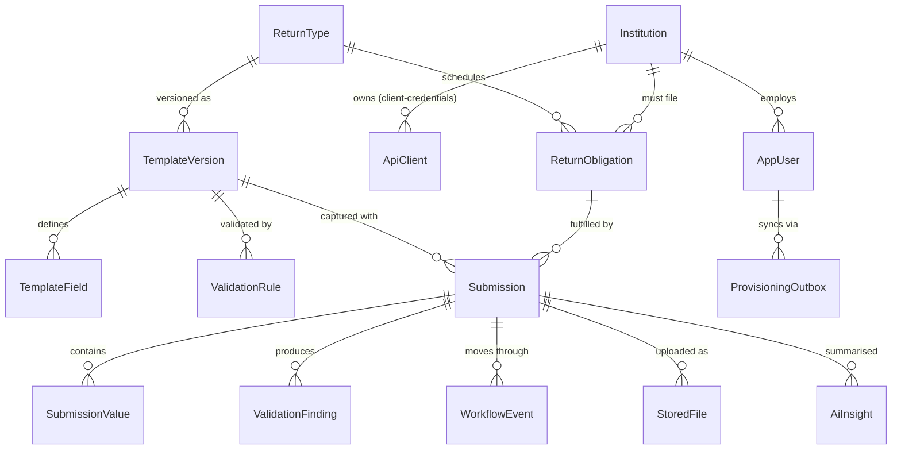
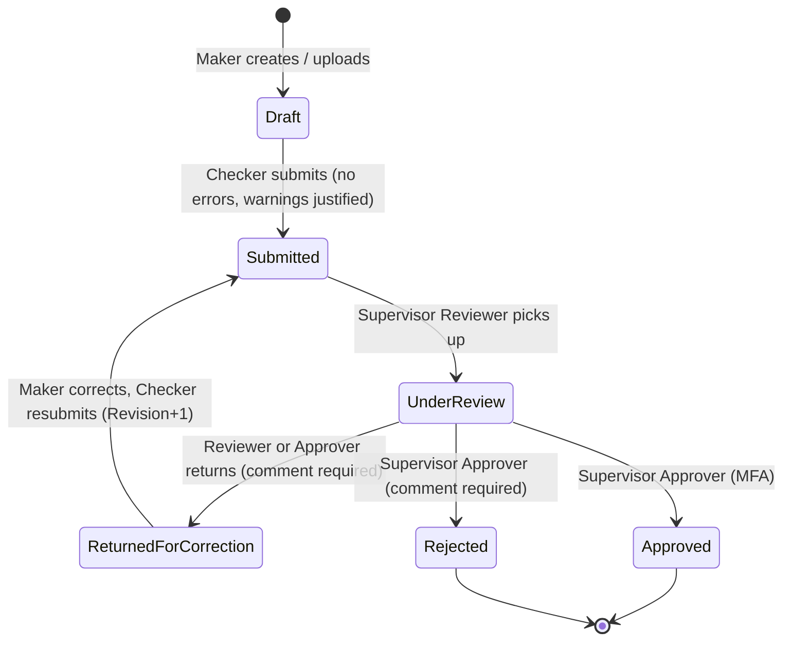
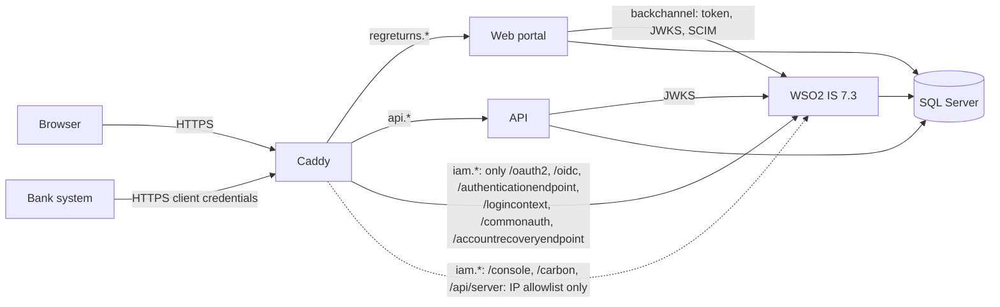
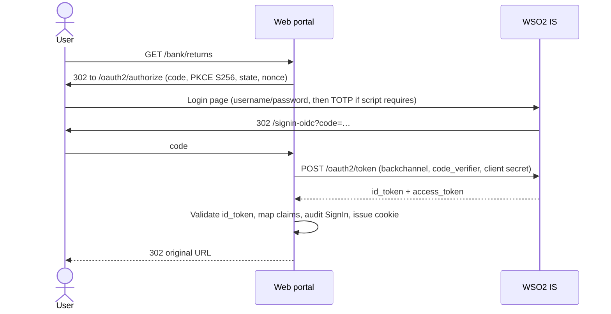

# RegReturns – Implementation Plan

> Living document. Where implementation refined the plan, the change is recorded as an ADR in [adr/](adr/) and noted inline.

Status: **approved 2026-10-04**, with observability/troubleshooting (§7) and engineering standards (§8) added at the owner's request

This plan covers the solution structure, data model, WSO2 Identity Server integration design and the twelve build phases. Decisions I made myself are marked **(ADR)** and will each become a short record under `docs/adr/`. 

---

## 1. Baseline choices

| Area | Choice | Why |
|---|---|---|
| Runtime | **.NET 10 LTS** (SDK 10.0.x), C# 14, `Nullable` + `TreatWarningsAsErrors` on in `Directory.Build.props` | Latest LTS; zero-warning builds enforced by the compiler, not by discipline |
| Package management | Central Package Management (`Directory.Packages.props`), locked restore in CI | One place to audit versions; supports the vulnerable-package gate |
| Web UI | ASP.NET Core MVC + Razor, Bootstrap 5.3, Chart.js 4, served via LibMan (no Node build) | Matches the brief; keeps the toolchain .NET-only |
| API | ASP.NET Core controllers, `Asp.Versioning.Mvc` (URL segment `/v1`), Swashbuckle for Swagger UI with OAuth2 client-credentials flow **(ADR)** | Swashbuckle's UI has first-class OAuth config for reviewers |
| Data | SQL Server 2025 (ADR 0013) + EF Core 10 code-first; Dapper for dashboard aggregates only **(ADR)** | EF for the write model; Dapper where a hand-tuned GROUP BY is clearer |
| Expressions | NCalc (MIT) for cross-field rules, sandboxed (no reflection / custom functions beyond a whitelist) **(ADR)** | Safe, declarative, storable in the DB |
| Excel/PDF | ClosedXML (MIT) for import/export; QuestPDF Community licence for PDF **(ADR)** | Both free for this use; QuestPDF has a clean fluent API |
| Scheduling | `BackgroundService` + Cronos (MIT) for nightly reset, obligation generation, SCIM outbox **(ADR)** | Avoids a Hangfire dependency for three small jobs |
| Logging | Serilog (console JSON + rolling file), request logging with a destructuring policy that drops tokens, emails and figures | "No sensitive data in logs" is enforced in one place |
| Testing | xUnit v3 on Microsoft Testing Platform, NSubstitute, Shouldly, `WebApplicationFactory`, Testcontainers.MsSql (ADR 0011) | |
| IdP | **WSO2 IS 7.3.0** (`wso2/wso2is:7.3.0`, latest 7.x tag on Docker Hub today) | |

Fictional regulator: **"Bank of Valoria"**, currency **VLD**, figures in VLD millions. Five banks: Harbourline Bank PLC, Crestmont Commercial Bank, Lotus Union Bank, Northgate Savings Bank, Meridian Development Bank.

---

## 2. Solution structure

```
regreturns-portal/
├─ src/
│  ├─ RegReturns.Domain/            Entities, value objects, enums, domain events, workflow state machine,
│  │                                 domain exceptions. No package references beyond the BCL.
│  ├─ RegReturns.Application/       Use cases (command/query handlers), DTOs, validation engine,
│  │                                 interfaces (IAppDbContext, IAuditTrail, IIdentityProvisioner,
│  │                                 IAiInsightService, IClock, ICurrentUser, IFileScanner...),
│  │                                 authorization requirement types & policy names.
│  ├─ RegReturns.Infrastructure/    EF Core DbContext + configurations + migrations, Dapper read queries,
│  │   ├─ Persistence/              audit hash-chain writer, ClosedXML/QuestPDF adapters,
│  │   ├─ Identity/Wso2/            WSO2 clients (SCIM 2.0, Applications, API Resources, Claims, Roles,
│  │   │                             Adaptive script), backchannel HttpClient + trust config,
│  │   ├─ Ai/                       Anthropic provider + rule-based fallback,
│  │   └─ Jobs/                     demo reset, obligation generator, SCIM outbox dispatcher.
│  ├─ RegReturns.Web/               MVC portal (Areas: Bank, Supervision, Admin, Audit, Demo) + public pages,
│  │                                 OIDC wiring, policies, security headers, health UI.
│  └─ RegReturns.Api/               Versioned REST API, JWT bearer, ProblemDetails, idempotency filter,
│                                    rate limiting, Swagger.
├─ tools/
│  ├─ RegReturns.Migrator/          Legacy CSV migration (dry-run, mapping, error report, reconciliation)
│  │                                 + `seed` and `migrate-db` verbs used by deploys.
│  └─ RegReturns.IamBootstrap/      Idempotent WSO2 provisioning; thin console over Infrastructure/Identity/Wso2.
├─ tests/
│  ├─ RegReturns.UnitTests/         Domain rules, validation engine, workflow, policies, audit chain, AI fallback.
│  └─ RegReturns.IntegrationTests/  API + Web via WebApplicationFactory, real SQL Server (Testcontainers),
│                                    test auth handler issuing role/institution claims.
├─ scripts/                         smoke-wso2.sh, server-setup.sh, backup/restore, dev-certs.sh
├─ deploy/                          Caddyfile(s), wso2 deployment.toml template, sql init
├─ samples/legacy/                  Generated messy legacy CSVs
├─ docs/                            ARCHITECTURE, IAM, API, DATA-MIGRATION, SECURITY, DEPLOYMENT,
│                                    DR-RUNBOOK, USER-GUIDE, BACKLOG, adr/
├─ docker-compose.yml / docker-compose.prod.yml / .env.example
├─ Directory.Build.props / Directory.Packages.props / .editorconfig / global.json
├─ CLAUDE.md / README.md
└─ .github/workflows/ ci.yml, codeql.yml, deploy.yml
```

Dependency rule: Domain ← Application ← Infrastructure ← Web/Api/tools. Web and Api both call Application directly (the portal does **not** go through the REST API), so they share one set of use cases and rules. An architecture test (NetArchTest) fails the build if a layer reference points the wrong way or a controller depends on `DbContext`.

Use-case style: plain handler classes (`SubmitReturnHandler : ICommandHandler<SubmitReturn, Result>`) registered by assembly scan, with a small pipeline for logging, validation and transactions. No MediatR (licence changed in 2025) **(ADR)**.

---

## 3. Data model



### Reference & identity
- **Institution**: `Id`, `Code` (e.g. `HLB`), `Name`, `LicenceCategory` (Commercial / Savings / Development), `IsActive`. The value carried in WSO2's `institution_id` claim is `Institution.Code`.
- **ApiClient**: `InstitutionId`, `Wso2ClientId`, `Name`, `IsActive`. Maps a client-credentials token's `client_id`/`azp` to one institution (§4.4).
- **AppUser**: a *directory projection*, never a credential store. `Id`, `Wso2UserId` (SCIM id = OIDC `sub`), `UserName`, `DisplayName`, `Email`, `InstitutionId?`, `Roles` (owned collection of `Role` enum), `Status` (Active / Disabled), `ProvisioningState` (Pending / Synced / Failed), `IsDemoAccount`.
- **ProvisioningOutbox**: `Id`, `AppUserId`, `Operation` (Create / Update / Disable / Enable / ResetDemo), `PayloadJson` (no passwords; WSO2 emails or a one-time set-password link handles that, demo users get a configured password), `Attempts`, `NextAttemptAt`, `LastError`, `CompletedAt`.

### Templates & rules
- **ReturnType**: `Code` (`MLR`, `QCAR`, `MDA`), `Name`, `Frequency` (Monthly / Quarterly), `DueDaysAfterPeriodEnd`, `IsActive`.
  - MLR – Monthly Liquidity Return (HQLA by level, 30-day outflows/inflows, LCR %, liquid assets ratio)
  - QCAR – Quarterly Capital Adequacy Return (CET1, AT1, Tier 2, RWA by risk type, CET1/Tier 1/total capital ratios)
  - MDA – Monthly Deposits & Advances Return (deposits by type, loans by sector, NPLs, NPL ratio)
- **TemplateVersion**: `ReturnTypeId`, `Version`, `EffectiveFrom`, `Status` (Draft / Published / Retired). Submissions pin the version they were captured with, so editing a template never rewrites history **(ADR)**.
- **TemplateField**: `Code`, `Label`, `Section`, `DataType` (Decimal / Integer / Percentage / Text / Date / Boolean), `Unit`, `DisplayOrder`, `IsRequired`, `Precision`.
- **ValidationRule**: `Code`, `RuleType` (Required / Range / DataType / CrossField / Variance), `Severity` (Error / Warning), `TargetFieldCode`, typed parameter columns (min/max, expression pair + tolerance, variance threshold % + comparison basis; see ADR 0008), `Message`, `IsActive`.

### Submission lifecycle
- **ReportingPeriod** (value object): `Year`, `Frequency`, `Number` (month 1-12 or quarter 1-4) with derived `Start`/`End`.
- **ReturnObligation**: `InstitutionId`, `ReturnTypeId`, `Period`, `DueDate`, `Status` (Open / Fulfilled / Overdue). Generated by a job each period; drives compliance and overdue dashboards. Unique on (institution, type, period).
- **Submission** (aggregate root): `ObligationId`, `TemplateVersionId`, `Status`, `Revision` (increments on each return-for-correction), `Source` (Web / Upload / Api / Migration), `PreparedBy`, `SubmittedBy`, `ReviewedBy`, `DecidedBy` (WSO2 subject ids), `SubmittedAt`, `IsLate`, `IdempotencyKey?`, `RowVersion` (optimistic concurrency).
- **SubmissionValue**: `SubmissionId`, `FieldCode`, `RawValue` (string as entered), `NumericValue` (decimal(19,4)?), `TextValue`. Narrow key-value table with a typed numeric column so reporting stays a plain SQL aggregate **(ADR, vs JSON column)**.
- **ValidationFinding**: `SubmissionId`, `Revision`, `RuleId`, `FieldCode`, `Severity`, `Message`, `Justification?`, `JustifiedBy?`.
- **WorkflowEvent**: `SubmissionId`, `FromStatus`, `ToStatus`, `ActorSubjectId`, `ActorRole`, `Comment`, `OccurredAt`.
- **StoredFile**: `SubmissionId`, `OriginalFileName` (sanitised, display only), `ContentType` (from signature sniffing, not the browser), `SizeBytes`, `Sha256`, `Content` (varbinary, max 5 MB). Stored in the DB, never on a web-served path, so backups cover them and nothing is ever served as-is **(ADR)**.
- **AiInsight**: `SubmissionId`, `Revision`, `Provider`, `Model`, `InputDigest` (hash of the aggregate payload sent), `Summary`, `CreatedAt`. Cached per revision.

### Audit & API plumbing
- **AuditEntry**: `Sequence` (bigint identity), `OccurredAt`, `ActorSubjectId`, `ActorDisplayName`, `ActorType` (User / ApiClient / System), `InstitutionId?`, `Action` (enum: SignIn, SignOut, AccessDenied, Created, Updated, StateChanged, AiInvoked, DemoReset...), `EntityType`, `EntityId`, `BeforeJson`, `AfterJson`, `IpAddress`, `CorrelationId`, `PreviousHash`, `Hash`.
  - `Hash = HMAC-SHA256(key, canonical(entry fields) ‖ PreviousHash)`. The HMAC key comes from configuration, so someone with DB access alone cannot re-forge the chain **(ADR)**.
  - Entries are written in the same transaction as the change they describe, by an EF `SaveChanges` interceptor (before/after values from the change tracker, with fields marked `[NotAudited]` excluded). Appends take `sp_getapplock` so the chain stays strictly linear under concurrency.
  - The Auditor screen walks the chain in batches and reports the first broken link (sequence gap, hash mismatch or edited row).
- **IdempotencyRecord**: `ClientId`, `Key`, `RequestHash`, `StatusCode`, `ResponseBody`, `ExpiresAt`. Unique on (ClientId, Key). The same key with a different body returns 422.
- **MigrationRun / MigrationRowError** (schema `migration`): run metadata, dry-run flag, source file hash, counts and per-row errors for the reconciliation report.

### Workflow (Domain state machine)



Segregation of duties, enforced in the Domain and covered by tests:
- The checker who submits cannot be the person who prepared or last edited the draft.
- The approver cannot be the reviewer of the same revision.
- No supervisor can act on a submission from their own institution (supervisors have none, but the rule is explicit).
- Every transition other than *pick up* requires a comment. `IsLate` is set on first submission when `SubmittedAt > DueDate`.

---

## 4. WSO2 Identity Server integration

### 4.1 Topology



- **WSO2 persistence on SQL Server** (separate `WSO2_IDENTITY_DB` and `WSO2_SHARED_DB` on the same instance) via a thin Dockerfile `FROM wso2/wso2is:7.3.0` that adds the Microsoft JDBC driver, plus a one-off init container that runs WSO2's shipped `dbscripts/mssql.sql`. One backup/restore story covers both app and IAM data, which keeps the DR runbook honest **(ADR)**. Fallback, if this fights us in phase 2: the embedded H2 DB on a named volume, backed up as files.
- **Admin hardening**: `deployment.toml` is rendered from a template; `[super_admin]` username and password come from `$env{…}` variables in `.env`. The default `admin/admin` never exists. The console and management APIs are reachable publicly only from `WSO2_ADMIN_ALLOWLIST` CIDRs in Caddy, and IamBootstrap reaches them over the internal Docker network.
- **TLS and trust**: `scripts/dev-certs.sh` creates a local CA and a WSO2 certificate with SANs `wso2`, `iam.localhost` and `iam.${DOMAIN}`, imported into WSO2's keystore. Web, Api and IamBootstrap trust **that CA only, explicitly**, through `Wso2:TrustedCaPath`: a custom-root `X509Chain` validation on the backchannel `HttpClient` (`X509ChainTrustMode.CustomRootTrust`). Nothing disables validation. In production, public traffic uses Caddy's Let's Encrypt certificates, and the backchannel keeps the same pinned CA.
- **Public vs internal URLs**: WSO2 is configured with `hostname = iam.${DOMAIN}` behind a proxy, so the issuer and all discovery URLs are public. Containers call the backchannel through a `DelegatingHandler` that rewrites `https://iam.${DOMAIN}` to `https://wso2:9443`. The issuer is still validated against the public value.

### 4.2 What IamBootstrap creates (idempotent: look up by name, create or patch, never duplicate)

| Object | Detail |
|---|---|
| Local claim `http://wso2.org/claims/institution_id` → OIDC claim `institution_id` | Added to a custom OIDC scope `institution` |
| Roles (application audience on the portal app) | `bank_maker`, `bank_checker`, `supervisor_reviewer`, `supervisor_approver`, `system_admin`, `auditor` |
| API resource `https://api.regreturns` | Scopes `returns:read`, `returns:submit`, `reference:read` |
| OIDC app **RegReturns Portal** | Code flow + PKCE, confidential client, JWT access tokens, redirect `/signin-oidc`, post-logout `/signout-callback-oidc`, back-channel logout URL, requested claims `roles` and `institution_id`, access token 300 s, refresh disabled (cookie session instead), adaptive script (§4.5) |
| M2M app per demo bank (×5) | Client credentials only, authorised for `returns:read` and `returns:submit` on the API resource, token 300 s. The client id is written to `ApiClient` in the app DB |
| M2M app **RegReturns Provisioner** | Client credentials, authorised only for the SCIM2 Users and Roles internal scopes the portal needs |
| Demo users | One per role, plus `approver.mfa` with TOTP enrolled. Bank users get `institution_id`. Self-service password and MFA changes disabled (§4.6) |
| Swagger demo client | A client-credentials app for "Demo Bank API" scoped to one bank, whose secret is published on the demo page |

Secrets that WSO2 generates (client secrets) are written to a git-ignored `.env.generated` locally, or printed once for the server's env file. They are never written to the repo or logs.

### 4.3 Portal sign-in (OIDC)



- Claim mapping, via an `IClaimsTransformation` and the OIDC `OnTokenValidated` event: `sub` becomes the subject id, `roles` (array or space-separated) becomes `ClaimTypes.Role` using a role-name constant map, `institution_id` is kept as is, and `amr` is kept for the MFA check. Unknown roles are dropped and logged.
- The AppUser projection is upserted on first sign-in (JIT link by `sub`) so audit entries resolve to names.
- The cookie is `__Host-` prefixed, HttpOnly, Secure, SameSite=Lax, with 20-minute sliding and 8-hour absolute expiry. Tokens are not stored in the cookie beyond the `id_token_hint` needed for logout.
- Logout: RP-initiated logout to `/oidc/logout` with `id_token_hint`, then audit SignOut. Back-channel logout from WSO2 invalidates the session through a server-side session-id deny list.

### 4.4 API authorization
- JWT bearer checks the issuer (public), the audience (`https://api.regreturns`), `RS256` signing keys from JWKS (cached and auto-refreshed via the backchannel handler), lifetime with 30 s clock skew, and requires `client_id`/`azp`.
- Scope policies: `Returns.Read` needs `returns:read` and `Returns.Submit` needs `returns:submit`.
- Institution scoping: an `ApiClient` lookup maps `azp` to an institution. Every query and command is filtered by it, and a token for Bank A requesting Bank B's resource gets a 404 (not a 403, so it does not reveal that the resource exists). Supervisors don't use the API in this scope.

### 4.5 Policies and MFA
Policy names live in `Application/Authorization/Policies.cs`, with no magic strings:

| Policy | Requirement |
|---|---|
| `Bank.PrepareReturn` | role bank_maker + institution claim; resource handler checks same institution |
| `Bank.SubmitReturn` | role bank_checker + same institution + not the preparer (domain rule also enforces) |
| `Supervision.Review` | supervisor_reviewer |
| `Supervision.Approve` | supervisor_approver **and**, when `Iam:EnforceMfa` is true, `amr` contains TOTP (defence in depth: the app refuses the action even if WSO2 config drifts) |
| `Admin.Manage` | system_admin (+ MFA as above) |
| `Audit.Read` | auditor or system_admin; auditor has no write policies anywhere |
| `Reports.View` | any supervisor, auditor or admin; bank users see only their own institution |

Every controller has a fallback policy of "authenticated" plus an explicit `[Authorize(Policy = …)]`. Public pages opt out with `[AllowAnonymous]`, and a test enumerates all endpoints to prove none are missing.

Adaptive script (generated by IamBootstrap from `Iam:EnforceMfa` and `Iam:MfaAlwaysUsers`):

```js
var enforceForRoles = ['supervisor_approver', 'system_admin'];
var enforce = /*{{EnforceMfa}}*/ true;
var alwaysUsers = /*{{MfaAlwaysUsers}}*/ ['approver.mfa'];
var onLoginRequest = function (context) {
  executeStep(1, { onSuccess: function (context) {
    var user = context.currentKnownSubject;
    var needs = alwaysUsers.indexOf(user.username) >= 0 ||
                (enforce && hasAnyOfTheRolesV2(context, enforceForRoles));
    if (needs) { executeStep(2); }   // step 2 = TOTP
  }});
};
```

In the hosted demo `EnforceMfa=false`, so the password-only approver and admin accounts stay easy to try, and `approver.mfa` always gets TOTP. The demo page shows that account's TOTP secret as text and a QR code.

### 4.6 Provisioning, demo safety, audit
- **Admin creates/disables a user**: the Application layer writes `AppUser` + `ProvisioningOutbox` in one transaction. The outbox dispatcher calls SCIM 2.0 (`POST /scim2/Users`, `PATCH active=false`, role assignment via `PATCH /scim2/v2/Roles/{id}`) using the Provisioner client, retrying with backoff. The UI shows Pending / Synced / Failed. This keeps the portal correct if WSO2 is briefly down **(ADR)**.
- **Demo users cannot change password/MFA**: the portal exposes no such UI; IamBootstrap disables the My Account app and self-service password recovery. Demo users also carry an `isDemo` marker so the admin screens refuse edits to them.
- **Demo TOTP secret**: setting a known secret via SCIM on the TOTP secret claim is the preferred route. This is a **spike at the start of phase 2**. Fallback: bootstrap enrols through the TOTP REST API as that user and stores the returned secret (encrypted with Data Protection) for the demo page.
- **Nightly reset**: re-seed app data in a transaction, start a fresh audit chain with a `DemoReset` genesis entry, and run the IamBootstrap "demo users" step (reset passwords, roles and TOTP; delete users created by visitors). The admin "Reset demo" button does the same, rate-limited to 1 per 10 minutes.
- **Audit of auth events**: `OnTokenValidated` records SignIn and sign-out records SignOut. A custom `IAuthorizationMiddlewareResultHandler` (Web) and `JwtBearerEvents.OnForbidden/OnAuthenticationFailed` (API) record AccessDenied, with the subject id, path, policy and IP, de-duplicated per subject+path per minute so the trail can't be flooded.

### 4.7 Testing identity
- Integration tests: a `TestAuthHandler` scheme whose principal (roles, institution, amr, client id) is set per test through a header or builder; production auth registration is replaced in `WebApplicationFactory`.
- `scripts/smoke-wso2.sh` (plus an xUnit `[Trait("Category","Wso2Smoke")]` project target) runs against the real container. It checks discovery and JWKS, gets a client-credentials token and calls the API (200 for own bank, 404 for another), checks that the API rejects a token for the wrong audience, and runs a headless Playwright login as maker that lands on the dashboard. The full scenario including TOTP runs in phase 9 using the published demo secret.

---

## 5. Validation engine

- `IValidationRule` implementations per `RuleType`, built from `ValidationRule` rows by a factory. The engine runs all of them against a `SubmissionSnapshot` and returns `ValidationFinding`s.
  - Required, Range (min/max, inclusive flags), DataType (parse against field type and precision)
  - CrossField: an NCalc expression over field codes, e.g. `[TOTAL_HQLA] == [L1] + [L2A] + [L2B]` with an absolute tolerance, or `[LCR] >= 100`
  - Variance: `|current − prior| / |prior| > threshold%` against the last **approved** submission for the same institution, type and prior period (or the same period last year, as configured). Usually a warning.
- Errors block *Submit*. Warnings need a justification of at least 20 characters per finding before the checker can submit. Findings are shown inline per field and in a summary panel.
- The same engine runs for web forms, Excel/CSV upload (after parsing to the same snapshot), API submissions and the migrator.

---

## 6. Other features in brief

- **Upload**: extension allow-list (`.xlsx`, `.csv`) plus magic-byte check (ZIP header plus the `[Content_Types].xml` part for xlsx; UTF-8 text without NUL bytes for CSV), a 5 MB limit at Kestrel and in the handler, macro-enabled formats rejected, and parsing into values only. Files are never stored on disk or served back.
- **Dashboards**: compliance heat-map (bank × period: on time / late / missing), overdue list, validation-failure trend by rule, and key-ratio sparklines. Aggregates come from Dapper views. Excel export via ClosedXML, PDF via QuestPDF.
- **API v1**: `GET /v1/return-types`, `GET /v1/submissions?page=&pageSize=&status=&period=` (paging metadata in body and `Link` headers), `GET /v1/submissions/{id}`, `POST /v1/submissions` (requires an `Idempotency-Key` header), `GET /v1/submissions/{id}/validation`. Errors are RFC 9457 ProblemDetails with a `traceId`. Rate limiting is a fixed window per client id. Swagger UI has an OAuth2 client-credentials flow pre-filled with the demo client id.
- **Migrator**: `regreturns-migrator legacy --source samples/legacy --dry-run --report out/` reads CSVs, cleans them (multi-format dates, thousand separators, `N/A` → null, duplicate rows by natural key with last-wins plus a report entry), maps legacy bank names and field codes via a JSON mapping file, validates through the same engine, and writes Approved historical submissions marked `Source=Migration`. The reconciliation report gives row counts and per-field totals, source vs target, by bank and period, as CSV and console tables. The exit code is non-zero on reconciliation mismatch.
- **AI insight**: `IAiInsightService` builds an aggregated payload (field codes, current and prior values, % changes, validation findings; never names, emails or free-text comments). The provider is chosen by `Ai:Provider` (`Anthropic` | `RuleBased`), and the API key comes from user-secrets or env. If no key is set, or on timeout or error, the rule-based generator writes the same structure of summary (top movers, threshold breaches, likely causes mapped from rule types). Every call is audited with provider, model, input digest and outcome. Output is shown as advisory, HTML-encoded and clearly labelled.

---

## 7. Observability and troubleshooting

Goal: when something goes wrong, anyone on support can go from a user's "error reference" to the exact request, log lines, SQL calls and WSO2 call in a couple of minutes.

**Correlation everywhere**
- W3C Trace Context (`traceparent`) is the single correlation id. It flows browser request → Web → WSO2 backchannel / SQL, and bank system → API → SQL. Every log event carries `TraceId`, `SpanId`, `UserSubjectId` (or `ClientId`), `InstitutionCode`, `RequestPath` and the app version.
- Every error response shows it: ProblemDetails has `traceId`; the MVC error page shows "Error reference: 4bf92f35…" so a user can quote it; the API echoes it in a `X-Trace-Id` response header.
- Audit entries store the same `CorrelationId`, so the business trail and the technical logs join on one value.

**Structured logging (Serilog)**
- JSON to stdout (Docker-native) plus OTLP export. Message templates only, no string interpolation; event ids grouped per area (`LogEvents.Wso2.*`, `LogEvents.Validation.*`…) using source-generated `[LoggerMessage]` for hot paths.
- Redaction with `Microsoft.Extensions.Compliance.Redaction`: properties tagged `[PersonalData]` or `[Secret]` are redacted or hashed before they reach any sink; tokens, cookies, `Authorization` headers and return figures are never logged. A unit test asserts that a log of a sample user/submission contains no raw values.
- Levels are changeable at runtime through `appsettings` reload (`Serilog:MinimumLevel:Override`), so a namespace can go to Debug in production without a redeploy.
- Request logging: one summary line per request (method, route template, status, elapsed ms, size), not per middleware.

**Traces and metrics (OpenTelemetry)**
- Instrumentation for ASP.NET Core, HttpClient (WSO2, SCIM, LLM calls), EF Core / SqlClient and the background jobs, with custom `ActivitySource` spans around validation runs, workflow transitions, audit appends and migrator batches.
- Business and health metrics via `System.Diagnostics.Metrics`: submissions by status, validation errors by rule, late filings, SCIM outbox backlog and failures, AI calls and fallbacks, audit append latency, token validation failures.

**Where logs go**
- **Seq** (single container, free individual licence) receives logs and traces over OTLP in dev and on the VPS, capped at 512 MB RAM with 14-day retention, behind Caddy with the same admin IP allowlist as the WSO2 console **(ADR)**. Exporters are configuration only, so switching to Grafana/Loki/Tempo, Elastic or Azure Monitor is an env change, not a code change.
- Caddy writes JSON access logs; WSO2 logs go to stdout with its `audit.log` and `http_access` logs on a volume. Docker uses the `json-file` driver with size rotation so the disk can't fill.

**Diagnostics in the app**
- `/health/live` (process up) and `/health/ready` (SQL, WSO2 discovery + JWKS, SCIM reachability, outbox backlog under threshold, disk space) with JSON detail visible to admins only; the public status page shows green/amber/red.
- Admin "Diagnostics" page: running version and git SHA, environment, SCIM outbox items with last error and a retry button, recent background job runs, and current log-level overrides.
- Global exception handling via `IExceptionHandler`: users see a friendly message and the reference id; the stack trace is logged, never returned.

**docs/TROUBLESHOOTING.md** (new): how to find a request by error reference in Seq; common failures with symptoms, cause and fix (WSO2 certificate not trusted, issuer mismatch, clock skew, `invalid_client`, missing `roles` claim, SCIM 401/409, SQL login failures, migration lock); `docker compose` commands for logs and restarts; how to raise a log level temporarily.

---

## 8. Engineering standards and maintainability

**Code quality gates (fail the build, not a review comment)**
- `.editorconfig` with the .NET naming and style rules, `EnforceCodeStyleInBuild`, `AnalysisLevel=latest-recommended`, SonarAnalyzer.CSharp and `Microsoft.VisualStudio.Threading.Analyzers`, warnings as errors, `dotnet format --verify-no-changes` in CI.
- Architecture tests (NetArchTest) for layer direction and naming, and a test that every endpoint carries an authorization policy.
- Coverage collected with Microsoft code coverage (Cobertura) and published in CI; a floor of 80% line coverage on Domain (Application once it holds business logic), no target on UI glue (ADR 0011).

**Design conventions (written down in CLAUDE.md and ADRs)**
- SOLID, small classes, one use case per handler; a `Result`/`Error` type for expected failures instead of exceptions for control flow.
- Options pattern with `ValidateDataAnnotations().ValidateOnStart()`, so a missing setting fails at startup with a clear message, not at 2 a.m.
- `TimeProvider` for every clock read; UTC in storage, ISO 8601 on the wire, invariant culture for parsing; money and figures as `decimal`.
- `CancellationToken` through every async call; no `.Result`/`.Wait()`.
- Public APIs carry XML docs (`GenerateDocumentationFile` with CS1591 as an error in src projects).

**Standards the code and docs map to**

| Area | Standard |
|---|---|
| Security | OWASP ASVS 4.0 Level 2 checklist in SECURITY.md, OWASP Top 10 2021, OWASP API Security Top 10 2023 |
| Identity | OAuth 2.0 (RFC 6749), PKCE (RFC 7636), OIDC Core + RP-Initiated + Back-Channel Logout, JWT BCP (RFC 8725), SCIM 2.0 (RFC 7643/7644) |
| API | OpenAPI 3.1, RFC 9457 ProblemDetails, RFC 8288 Link headers, IETF Idempotency-Key header draft, RFC 9745 deprecation headers when a version is retired |
| Observability | W3C Trace Context, OpenTelemetry semantic conventions |
| Accessibility | WCAG 2.2 AA, checked with axe in the Playwright scenario run |
| Architecture docs | C4 model (context, container, component) diagrams; ADRs in MADR format |
| Ops | 12-factor configuration, semantic versioning, Conventional Commits, Keep a Changelog |

**Supply chain and repository hygiene**
- Dependabot for NuGet, Docker base images and GitHub Actions; actions pinned by commit SHA.
- CI produces a CycloneDX SBOM, runs Trivy on the built images and gitleaks for secrets, alongside CodeQL and the vulnerable-package check already planned.
- Repo files: LICENSE (MIT), CONTRIBUTING.md, CHANGELOG.md, PR and issue templates, CODEOWNERS, and a GitHub `SECURITY.md` policy pointing at docs/SECURITY.md.
- Version and git SHA are stamped into every assembly and image label and shown on the status page, so you always know which build is running.

---

## 9. Hosting shape (for phase 11)

| Container | Memory cap (8 GB VPS) |
|---|---|
| WSO2 IS (`-Xms512m -Xmx1536m`) | 2.5 GB |
| SQL Server 2025 Express (`MSSQL_PID=Express`, `memory.memorylimitmb=2048`) | 2.5 GB |
| Web, Api | 512 MB each |
| Caddy | 128 MB |
| Seq (logs + traces) | 512 MB |
| Backup sidecar (cron + `sqlcmd BACKUP`) | 128 MB |

GitHub Actions `deploy.yml`: build and test → push images to GHCR (tagged by SHA) → SSH (secrets: host, user, key, known_hosts) → `docker compose -f docker-compose.prod.yml pull && up -d` → `migrator migrate-db` → `iam-bootstrap` → `smoke-wso2.sh` against the public URLs. `ci.yml` covers build with warnings as errors, unit and integration tests (Testcontainers on the runner), `dotnet list package --vulnerable --include-transitive` failing on any High or Critical, and format check. `codeql.yml` runs C# analysis.

DR targets proposed for the runbook: **RPO 24 h** (nightly full backup, plus 1 h log backups if Express allows on disk) and **RTO 2 h** for a restore to a fresh VPS including DNS switch.

---

## 10. Phased plan

Each phase ends with a zero-warning build, all tests green, a conventional commit pushed to `main` of `github.com/rovindu12/regreturns-portal`, a summary in this thread, and a stop for your go-ahead.

| # | Phase | Delivers | Key tests |
|---|---|---|---|
| 1 | Scaffold, domain, DB, seed | Solution and projects, build props and analyzers, CLAUDE.md, ADR-0001…, Serilog + OpenTelemetry baseline with trace-id correlation and redaction, Seq in compose, Domain entities and workflow state machine, EF configurations and initial migration, seeder (5 banks, 3 return types with templates and rules, 12 months of history with planted anomalies), `docker-compose.yml` with SQL Server only, CI skeleton | Workflow transitions, SoD rules, ReportingPeriod/due dates, seeder idempotency, architecture tests |
| 2 | WSO2, IamBootstrap, OIDC, policies | WSO2 container on SQL Server, dev certs + explicit trust, IamBootstrap (all objects in §4.2), portal OIDC login/logout, claim mapping, all policies, auth audit events, TOTP spike outcome, smoke script v1 | Policy handlers, claim transformation, bootstrap idempotency (against container), smoke script; WSO2 troubleshooting entries |
| 3 | Templates, submission, validation | Admin template/field/rule screens, form entry with drafts, Excel/CSV upload with safe-file checks and template download, validation engine with per-field errors and warning justifications | Every rule type incl. variance, upload signature checks, draft save/load integration |
| 4 | Workflow and audit trail | All transitions with comments, SoD, late flags, reviewer/approver queues, audit interceptor with HMAC chain, Auditor verify screen | Transition matrix, chain tamper detection (edited row, deleted row, re-ordered row) |
| 5 | Web API | v1 endpoints, JWT validation, institution scoping, idempotency, pagination, rate limiting, ProblemDetails, Swagger with OAuth | Endpoint integration tests per policy, idempotency replay/conflict, cross-bank 404, 429 |
| 6 | Dashboards and reports | Compliance, overdue, validation trends, Chart.js views, Excel/PDF export | Aggregate queries against seeded data, export smoke |
| 7 | Migration tool | Messy legacy CSV generator, migrator with dry-run, mapping, error report, reconciliation | Cleansing functions (dates, numbers, dupes), reconciliation totals |
| 8 | AI assistant | Insight service, Anthropic provider, rule-based fallback, reviewer panel, audit of calls, payload PII guard | Payload contains no PII, fallback on missing key/timeout, audit written |
| 9 | Demo portal | Landing page (Mermaid, feature tour, role mapping), Try-the-demo cards, guided scenario, banner, status page, demo reset job and button, sandboxed admin | Reset job, demo user edit refusal, public pages anonymous, scenario Playwright run |
| 10 | Security hardening | Admin Diagnostics page, CSP with nonces, HSTS, frame-ancestors, security headers test, anti-forgery audit, log redaction review, Caddy allowlist, SECURITY.md threat model, CodeQL + vulnerable-package gates | Headers test, every-endpoint-has-policy test, anti-forgery on every POST |
| 11 | Docker, CI/CD, VPS | Dockerfiles (non-root, chiselled images), SBOM + Trivy + gitleaks, Seq on the VPS, `docker-compose.prod.yml`, Caddyfile, `.env.example`, `server-setup.sh`, backups and restore scripts, deploy workflow, health endpoints wired to status page | CI end-to-end, restore script tested locally |
| 12 | Docs and polish | README (live link, screenshots, Mermaid, quick start, logins, role-mapping table), all docs/* incl. TROUBLESHOOTING and C4 diagrams, BACKLOG with sprints, final ADRs, screenshot capture | Docs link check, full test run |

Working notes:
- This cloud workspace can install the .NET 10 SDK from Microsoft's package feed and pull the SQL Server and `wso2/wso2is:7.3.0` images (checked today), and it has 4 CPUs and 15 GB RAM. So I can build and test, and run WSO2 and Testcontainers here, before every push.
- Seed anomalies planned: Lotus Union LCR drops ~45% in one month (variance warning); Crestmont misreports Total HQLA ≠ sum of levels (error, corrected in a later revision); Northgate files QCAR late twice; Meridian has one missing MDA month (overdue); Harbourline shows a sudden NPL ratio jump (AI insight showcase).

---
