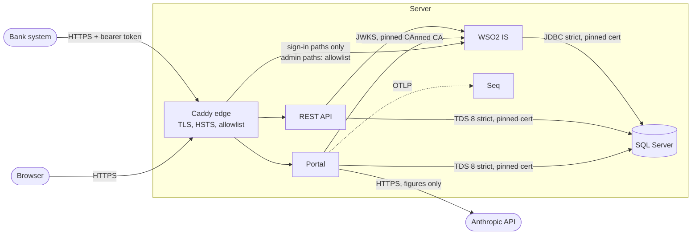

# Security: threat model and controls

RegReturns holds the figures licensed banks report to their regulator (fictional ones here: the Bank of Valoria and
five banks). A leaked return moves markets, a forged approval misleads supervision, and an altered history hides
either. This document names what we protect, from whom, where the trust boundaries are, which controls answer each
threat and how they are tested. Decisions behind the controls are in the [ADRs](adr/README.md); the reporting policy
is in the root [SECURITY.md](../SECURITY.md).

Status: phase 10 of 12. Container images, the production compose file and server hardening arrive in phase 11; items
marked *phase 11* are planned, not built.

## What we protect

| Asset | Why it matters | Where it lives |
|---|---|---|
| Return figures and findings | Confidential supervisory data; market-sensitive before publication | `returns` schema, exports, uploads (`returns.StoredFiles`) |
| Workflow decisions (submit, approve, reject) | A forged or self-approved return defeats maker-checker | `returns.Submissions` and history, audit chain |
| The audit trail | Evidence of who did what; must survive an insider with database access | `audit.AuditEntries` (append-only, HMAC chain) |
| Identities, roles and second factors | Every other control rests on them | WSO2 (`WSO2_IDENTITY_DB`, `WSO2_SHARED_DB`) |
| Secrets | Audit HMAC key, OIDC and API client secrets, provisioner secret, database passwords, Anthropic key | user-secrets locally, environment or `.env` on the server; never in git |
| Personal data | Names and e-mail addresses of staff | `iam.Users`, WSO2 |

## Actors

- **Bank staff**: makers prepare returns, checkers submit them; they see only their bank.
- **Regulator staff**: reviewers, approvers (with TOTP), auditors (read-only, chain verification), system
  administrators (with TOTP).
- **Bank systems**: machine clients of the REST API, one per bank, acting as a maker of that bank.
- **Anonymous visitors**: the public pages, the demo pages and the WSO2 sign-in pages.
- **Attackers**: an internet attacker; a malicious or compromised bank user trying to reach another bank's data; an
  insider at the regulator trying to approve their own work or rewrite history; a database administrator; a
  compromised dependency or build.

## Trust boundaries

1. **Internet to edge.** Everything public crosses Caddy: TLS with public certificates, HTTP redirected, HSTS.
2. **Edge to WSO2.** Only the end-user sign-in surface is public; the console, management APIs and SCIM need an
   allowlisted address.
3. **Apps to WSO2.** Server to server through the back channel, trusting only the RegReturns CA.
4. **Apps to SQL Server.** TLS 1.2+ wrapping the whole session (TDS 8), certificate pinned.
5. **Portal to Anthropic.** Optional; only codes, template text and figures leave.
6. **Bank to regulator.** Bank users and bank systems are untrusted for anything outside their own bank.
7. **CI to server.** GitHub Actions reaches the server only over SSH with a key restricted to one forced command;
   only Caddy publishes ports, and SQL Server sits on an internal network with no route out (ADR 0034).

## Threats and controls (STRIDE)

| # | Threat | Control | Tested by |
|---|---|---|---|
| S1 | Password guessing against staff accounts | WSO2 locks an account for 5 minutes after 5 failures in a row, with the same message as a wrong password (ADR 0033); TOTP for approvers and administrators | `AccountLockStepTests`; live check in ADR 0033 |
| S2 | Stolen password used to approve | Approval and administration policies require `amr=totp` from WSO2 (plan §4.5) | Policy tests, `smoke-wso2.sh` TOTP logins |
| S3 | Attacker enrols their own authenticator | Enrolment at sign-in off; demo users pre-enrolled; real users only inside an administrator-opened, audited, time-limited window (ADR 0020, 0032) | `AdaptiveScriptTests`, `AdminTotpEnrolmentTests` |
| S4 | Forged or misused tokens at the API | Issuer, audience, algorithm, lifetime and token type validated; the bank comes from the client registration, never from claims (ADR 0018) | API authentication tests, `smoke-wso2.sh` forged signature |
| S5 | Session theft or fixation | `__Host-` cookie (`Secure`, `HttpOnly`, `SameSite=Lax`); 20-minute sliding and 8-hour absolute lifetime; sign-out revokes the ticket and ends the WSO2 session; back-channel logout (ADR 0019) | Session tests |
| S6 | Spoofed TLS peer (WSO2, SQL Server) | Explicit trust of the RegReturns CA for WSO2; SQL Server certificate pinned by every client; verification never disabled (ADR 0015, 0033) | Live checks; `check-caddy.sh` foreign-CA case |
| T1 | Tampering with returns through forms | Anti-forgery token on every POST; optimistic concurrency on drafts (ADR 0023, 0033) | `PortalAntiforgeryTests` |
| T2 | Editing or deleting audit history | Append-only trigger, gap-free sequence, HMAC-SHA256 chain with a key the database does not hold; verification screen (ADR 0016, 0024) | Tamper tests (edited, deleted, re-ordered rows) |
| T3 | Malicious upload | Extension and signature must agree, no macros, zip-bomb limits, 5 MB, formula-injection guard, stored in the database, never served (ADR 0022) | Upload signature tests |
| T4 | Script injection (stored or reflected XSS) | Razor encoding; CSP with a per-response nonce and no `unsafe-inline`; no inline scripts, styles or handlers in views (ADR 0033) | `PortalSecurityHeadersTests`, view scan, CSP check in `demo-scenario.sh` |
| T5 | Clickjacking | `frame-ancestors 'none'` and `X-Frame-Options: DENY` | Header tests |
| T6 | Tampered dependency or build | Lock files with locked restore in CI, actions pinned by SHA, CodeQL, vulnerable-package gate; images built once, scanned (Trivy, fixable high and critical fail) and shipped by commit sha with a CycloneDX SBOM; third-party images pinned, tools by digest (ADR 0034) | CI, Release workflow, `ImagePinTests` |
| T7 | A stolen CI credential used to run commands on the server | The CI key is restricted to one forced command that accepts only `deploy <sha> <user>` for a commit on `main`; the host key is pinned; the registry token is the run's own, sent on stdin and never stored (ADR 0034) | `regreturns.sh ci-deploy` input checks |
| T8 | Restoring a backup whose audit history was changed | A restore starts nothing until `verify-audit` walks the chain with the HMAC key from `.env` (ADR 0034) | Release workflow round trip |
| T9 | A compromised app changing the schema or the audit table | The apps log in as `regreturns_app` in `regreturns_runtime`: no DDL, no trigger changes, `DENY UPDATE, DELETE` on the audit table (ADR 0034) | `RuntimeRoleTests` |
| R1 | Denying a decision | Every workflow step, sign-in, export, insight, reset and authenticator reset is an audit event with actor, time and trace id | Audit tests |
| I1 | A bank reading another bank's returns | Use cases scope by the caller's institution from the user record; other banks' ids answer 404 (ADR 0018, 0025) | Cross-bank 404 tests (portal and API) |
| I2 | Regulator staff seeing drafts | Supervisors see a return only once submitted (`ReturnVisibility`) | Visibility tests |
| I3 | Secrets or figures in logs | Logs never take secrets, tokens, e-mails or figures; redaction enricher as a safety net; request logs carry paths, not query strings; the edge redacts tokens in URLs (ADR 0033) | `SensitiveDataRedactionTests`, `check-caddy.sh` |
| I4 | Confidential data sent to the AI provider | Payload built from codes, template text and figures only, checked by a guard; never names, comments or ids; every call audited with digests (ADR 0030) | Payload builder and guard tests |
| I5 | Pages cached on a shared computer | `Cache-Control: no-store` on every signed-in answer | Header tests |
| I6 | Reconnaissance of the WSO2 console | Deny by default at the edge; only sign-in paths public; `;` path tricks refused | `check-caddy.sh` |
| I7 | Diagnostics leaking configuration | Administrator with TOTP only; secrets shown as "set" or "not set" | `AdminDiagnosticsTests` |
| I8 | Secrets committed to the repository | Secrets only in user-secrets, `.env` and `generated/` (git-ignored, mode 0600/0700); gitleaks scans the whole history in CI | `secret-scan` job |
| I9 | Backups read off the server | Off-site copies are encrypted with `age` to a key that never lives on the server; local backups are 0700 to the deploy user (ADR 0034) | `regreturns.sh backup` |
| D1 | API flooding by one client | Fixed-window rate limit per client (120 a minute), 429 with `Retry-After` (ADR 0027) | Rate limit tests |
| D2 | Duplicate deliveries | Idempotency keys per client with request fingerprint (ADR 0027) | Idempotency tests |
| D3 | Locking out a known user on purpose | Lock lasts 5 minutes and does not grow; accepted (ADR 0033) | - |
| E1 | Self-approval or skipping a step | `Submission.Permits` checks state, role, organisation and segregation of duties for every step (ADR 0025) | Transition matrix tests |
| E2 | An endpoint left without a policy | Every endpoint names a policy or is on the explicit anonymous list | `PortalEndpointMetadataTests`, API metadata tests |
| E3 | Signing in as a system or API client account | Reserved user names, no WSO2 link, refused by `LinkSignedInUser` | Identity tests |
| E4 | A demo visitor changing the demo for others | Demo accounts cannot be changed; self-service closed; nightly reset (ADR 0020, 0031) | Demo tests |

## OWASP ASVS 5.0, level 2

A chapter-level self-assessment against the [OWASP Application Security Verification Standard
5.0](https://owasp.org/www-project-application-security-verification-standard/). "Met" means the level 2
requirements of the chapter that apply to this system are addressed by the controls named; gaps are listed.

| Chapter | Status | How | Gaps |
|---|---|---|---|
| V1 Encoding and sanitization | Met | Razor output encoding; parameterised SQL (EF Core, Dapper); CSV formula-injection guard; model text rendered as text | - |
| V2 Validation and business logic | Met | `FieldValueParser` and `ValidationEngine` on every channel; workflow rules in the domain; idempotency and concurrency checks | - |
| V3 Web frontend security | Met | Nonce CSP, `nosniff`, `frame-ancestors`, `Referrer-Policy`, `Permissions-Policy`, COOP/CORP, HSTS, `__Host-` cookies | - |
| V4 API and web service | Met | Versioned API, JSON only for deliveries, ProblemDetails, rate limits, idempotency keys, `default-src 'none'` | - |
| V5 File handling | Met | ADR 0022 checks; nothing uploaded is served or executed | Malware scanning not done (files are parsed, never opened by people) |
| V6 Authentication | Met | WSO2 as the only identity store; TOTP for approvers and administrators; lockout; no self-service changes for demo users | Password policy is WSO2's default; breached-password check not configured |
| V7 Session management | Met | Signed-out cookie tickets are revoked (deny-list), sliding and absolute lifetimes, back-channel logout | - |
| V8 Authorization | Met | Policies on every endpoint; institution scoping in use cases; segregation of duties in the domain | - |
| V9 Self-contained tokens | Met | Signature, issuer, audience, algorithm, lifetime and type checks (ADR 0018) | - |
| V10 OAuth and OIDC | Met | Code flow with PKCE for the portal; client credentials for banks; narrow scopes for the provisioner | - |
| V11 Cryptography | Met | HMAC-SHA256 audit chain; .NET and WSO2 platform crypto only; random nonces from `RandomNumberGenerator` | Audit key rotation procedure (*phase 11* runbook) |
| V12 Secure communication | Met | TLS at the edge; pinned CA to WSO2; TDS 8 strict with pinned certificate to SQL Server | Internal HTTP between Caddy and the apps on the Docker network (*phase 11* keeps it on an internal network) |
| V13 Configuration | Partly | Options validated at start; secrets outside git; no `Server` header; diagnostics without secrets | Non-root, read-only containers and secret files in *phase 11* |
| V14 Data protection | Partly | `no-store` on signed-in answers; figures never logged; figures-only AI payload | Encryption at rest (disk or TDE) and encrypted backups in *phase 11* |
| V15 Secure coding and architecture | Met | Architecture tests; analyzers with warnings as errors; CodeQL; lock files; pinned actions | SBOM and image scanning in *phase 11* |
| V16 Security logging and error handling | Met | Structured logs with trace ids; security events in the audit chain; generic error pages and ProblemDetails without stack traces | Alerting on security events (*phase 11*, Seq) |
| V17 WebRTC | Not applicable | - | - |

## Residual risks and accepted trade-offs

- **The enrolment window.** While an administrator's window is open, the password alone can enrol a new
  authenticator (ADR 0032). Mitigated by a short window, one named person, no self-service, and the audit entry.
- **Swagger UI allows inline styles** on the API's origin, which holds no cookies (ADR 0033).
- **Deliberate lockout** of a known account for five minutes (ADR 0033).
- **The demo publishes its credentials.** Demo mode is off by default, demo accounts cannot be changed, and the
  reset refuses to run on a database with real users (ADR 0031).
- **The AI provider sees figures.** Only figures, codes and the regulator's own template text, and only when a key is
  configured; the provider is advisory and every call is audited (ADR 0030).
- **The deploy user is root-equivalent** through the `docker` group. The server runs nothing else, SSH takes keys only,
  and the CI key can run one command (ADR 0034).
- **WSO2's images are reported, not gated,** for vulnerabilities: they follow WSO2's releases, and only the sign-in
  paths are public.
- **Database administrators can read data.** The audit chain detects changes they make but not reads. Column
  encryption is out of scope for this project.

## Verifying the controls

| What | How |
|---|---|
| Headers, CSP, anti-forgery, anonymous endpoints, diagnostics | `dotnet test --project tests/RegReturns.IntegrationTests` |
| Redaction, policies, views without inline code, account lock step | `dotnet test --project tests/RegReturns.UnitTests` |
| Identity end to end (tokens, MFA, closed self-service) | `scripts/smoke-wso2.sh --browser` |
| The whole tour in a browser, with zero CSP violations | `scripts/demo-scenario.sh` |
| Edge: allowlist, sign-in paths, path tricks, upstream certificate, log redaction | `scripts/check-caddy.sh` (also in CI) |
| SQL Server encryption | `/admin/diagnostics` shows "encrypted, TDS 8" and how the connection validates the certificate |
| Static analysis and dependencies | CodeQL and the vulnerable-package job in GitHub Actions |
| Secrets in the history, shell scripts | The `secret-scan` (gitleaks) and `scripts` (ShellCheck) jobs in CI |
| Images, deploy, backup and restore | The Release workflow: SBOMs, Trivy gate, the production stack on the runner, browser smoke test, a restore that must take a change away |
| The audit chain on a server | `deploy/regreturns.sh verify-audit` (exit 2 when broken) |
