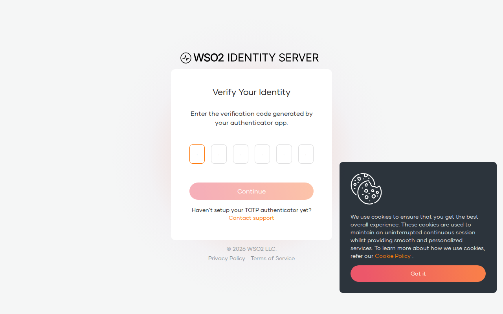
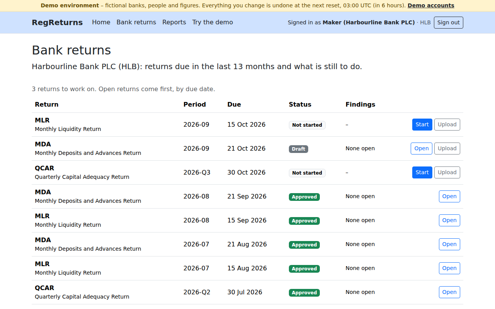
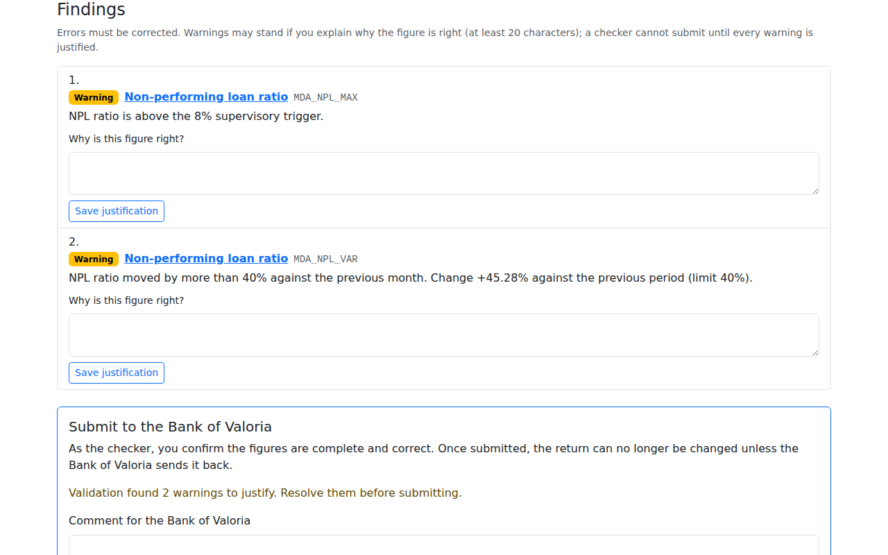
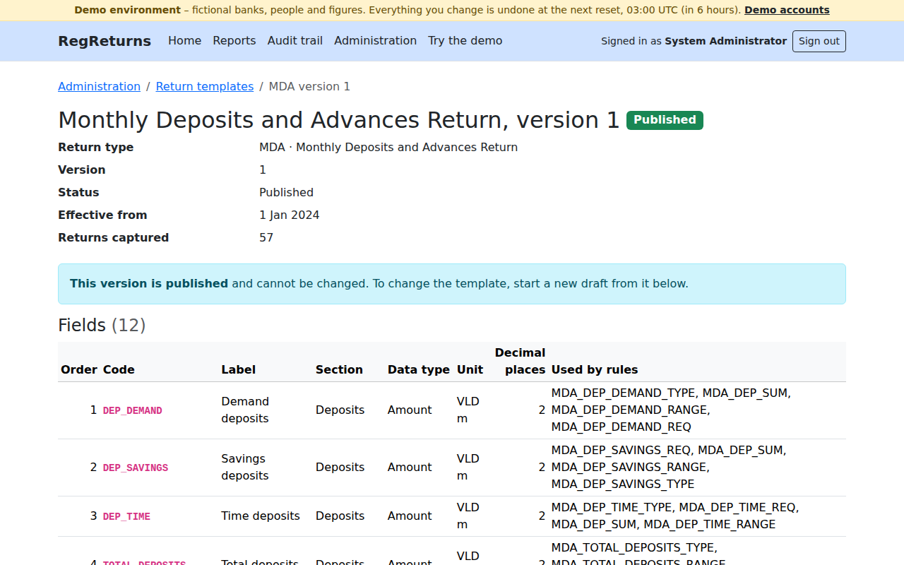
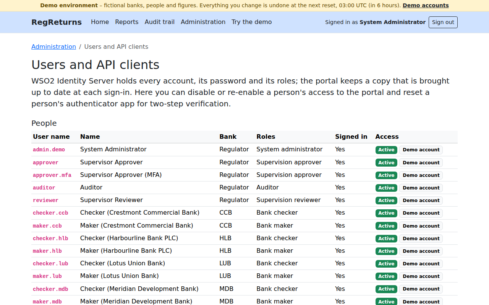
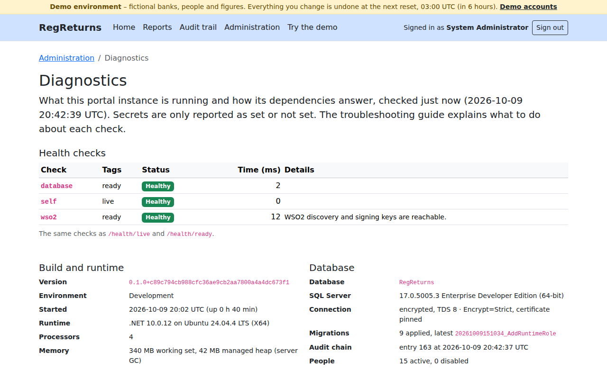
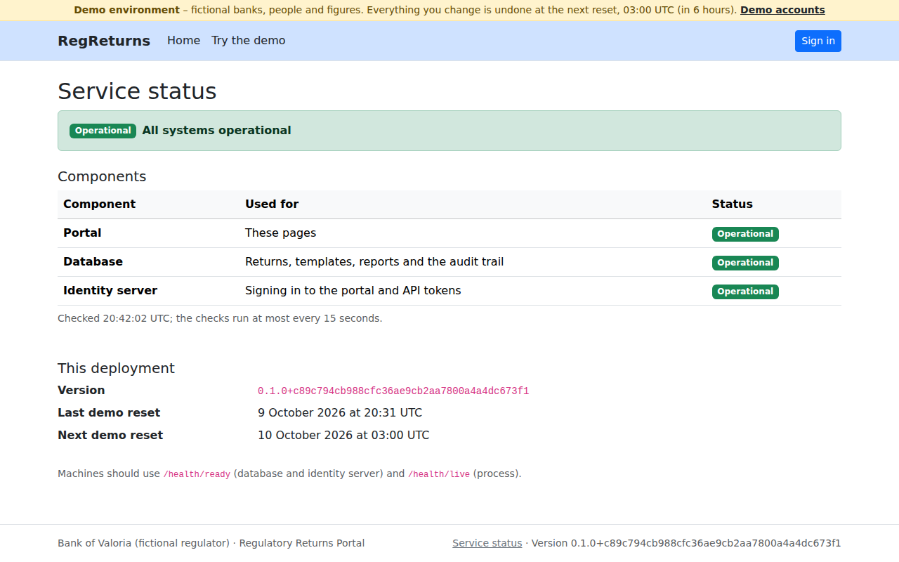

# User guide

How to use the RegReturns portal, role by role. Bank staff start with [preparing a return](#preparing-a-return-bank-maker);
the Bank of Valoria's staff start with [reviewing a return](#reviewing-a-return-supervision-reviewer). To try every
role in the public demo, see the [demo guide](DEMO.md). The screenshots come from the demo and are recaptured by
`scripts/demo-scenario.sh --screenshots`; every bank, person and figure in them is fictional.

## Signing in

Choose **Sign in** on any page. The portal sends you to the Bank of Valoria's sign-in page (WSO2 Identity Server):
enter your user name and password there, never in the portal. Approvers and administrators are then asked for the
six-digit code from their authenticator app.

- After five wrong passwords in a row your account is locked for a few minutes; the message is the same as for a wrong
  password, on purpose.
- If you lost the phone with your authenticator app, ask a system administrator to [reset your authenticator](#managing-access).
- **Sign out** (top right) ends your session in the portal and at the sign-in service.
- The menu shows only the areas your role can open. A page you cannot use answers *You do not have access to this
  page*; an address that does not exist, or a return that is not yours to see, answers *Page not found*. Both pages,
  like every error page, show a reference to quote to support.

## Preparing a return (bank maker)

**Bank returns** lists your bank's obligations: each return type and period, its due date, the status of its return
(overdue, filed late, its revision) and its open findings. **Open** works on a return; an obligation with nothing on
file offers **Start** and **Upload**.

On the return page:

1. Enter each figure in its field. Use a full stop for decimals and no currency symbol (thousand separators are fine).
   Amounts are in VLD millions; the hint under each field gives its type and precision.
2. Press **Save draft**. Saving keeps your figures and validates them. Blank fields are allowed in a draft.
3. Or work in a spreadsheet: **Download Excel** (or **Download CSV**) gives the template with every field and the
   values already entered. Fill in the *Value* column, keep the *FieldCode* column as it is, and **Upload a file**.
   The portal accepts `.xlsx` workbooks without macros (first sheet only) and UTF-8 `.csv` files of up to 5 MB, checks
   them by their content, loads the values into the draft and validates them. Uploaded files are kept as evidence and
   never opened or run by the portal.
4. Press **Validate** at any time. The summary counts errors, warnings and warnings still to justify, and every finding
   is shown next to its field and listed under *Findings*.

- An **error** (a missing figure, a total that does not add up) blocks submission until you correct the figure.
- A **warning** (a ratio over a supervisory trigger, a large movement against an earlier period) needs a written
  justification before the return can be submitted. A maker or a checker can write it.
- If someone else saved the return after you opened it, your save is refused and nothing is overwritten: reload the
  return to see their changes.

A maker can prepare, upload, validate and justify, but never submit.

## Submitting a return (bank checker)

Open the return from **Bank returns**. Under each warning, explain in at least 20 characters why the figure is right
and press **Save justification**. Then add a comment for the Bank of Valoria and press **Submit return**.

- You can submit only if you did not prepare the return and were not the last person to edit it. If you change a
  figure yourself, you become its last editor and another checker must submit it.
- Submitting needs a validation run after the last change, no errors and a justification for every warning.
- A return first submitted after its due date is marked late; the reports count it as filed late.
- If the Bank of Valoria returns it for correction, the return page shows their comment. Correct it, validate it and
  submit it again: it becomes the next revision, and the earlier one stays in the history.

## Reviewing a return (supervision reviewer)

**Supervision** is the worklist of returns the banks have submitted, in sections by where they are in the workflow,
each with its bank, due date, submission date and whether it was late. Filter it by bank, by return type or to late
returns only.

Open a return and press **Start review**. The page shows the figures, every finding with the bank's justification,
and the history of the return. You can then:

- Press **Generate insight** for an advisory note: the largest movements against earlier approved returns, the rules
  the return failed, likely causes and questions to ask the bank. *What was shared* shows exactly which figures left
  the portal, and the note says whether Claude or the portal's fixed rules wrote it. It is advice only: it never
  changes the return or its workflow ([advisory insights](AI-ASSISTANT.md)).
- **Return for correction** with a comment telling the bank what to fix.

## Deciding on a return (supervision approver)

Approvers sign in with a one-time code. Open a return under review, add a comment and press **Approve** or **Reject**,
or return it for correction. The reviewer of a return can never approve or reject it, even when they also hold the
approver role. Approving fulfils the bank's obligation; rejecting frees the obligation for a new return.

## Reports (every role)

**Reports** shows one return type at a time (tabs for MDA, MLR and QCAR):

- headline figures: the share filed on time, returns filed late, returns not due yet and returns overdue now;
- the **filing compliance** grid of banks by period (on time, late, overdue, not due yet);
- every **overdue** return, most overdue first;
- the **validation findings** trend by rule, and the trend of **key ratios** such as the liquidity coverage ratio, the
  non-performing loan ratio and the capital adequacy ratio, drawn from approved returns.

Every chart has the same figures as a table on the page. **Download Excel** and **Download PDF** export the compliance
report; each download is recorded in the audit trail. Bank staff see their own bank only.

## The audit trail (auditor)

**Audit trail** lists sign-ins, refusals, every change to the data, every workflow step, export and insight, newest
first, with what changed. Filter by action, entity or actor.

Press **Verify chain** to recompute every entry's hash and its link to the entry before it. Keep the newest entry and
hash it reports: a later check that finds an older newest entry reveals entries deleted from the end.

## Administration (system administrator)

Administrators sign in with a one-time code.

### Return templates

**Administration → Return templates** lists each return type's template versions. A published version cannot change:
to change a template, start a draft from it, change its fields and validation rules, set the date it applies from
(the first reporting period it covers) and publish it. Returns already filed keep the version they were captured with;
a version can be retired when no new return should use it.

A rule reports against one field and is either an **error** (blocks submission) or a **warning** (needs a
justification). Types: required, data type, range, cross-field (an expression over fields with `+ - * /`, `Min`, `Max`,
`Abs`) and variance (the movement against the previous period or the same period last year).

### Managing access

**Administration → Users and API clients** lists people with their bank, roles, last sign-in and access, and the API
clients of bank systems.

- **Disable** a person's access to the portal, or **enable** it again. Accounts, passwords and roles themselves live in
  WSO2 Identity Server ([IAM.md](IAM.md)).
- **Reset an authenticator** for someone who lost their phone or must enrol for the first time: at their next sign-in
  within the window shown, WSO2 asks them to scan a new QR code. You never see their secret.
- Demo, system and API client accounts, and your own account, cannot be changed.

### Diagnostics

**Administration → Diagnostics** shows the health checks, the build and runtime, the database and the settings that
matter for support, with secrets shown only as *set* or *not set* and endpoints by their origin only.

## Public pages

- `/` describes the portal and who does what.
- `/status` shows whether the portal, the database and WSO2 are operational.
- In the demo, `/demo` lists every demo account and `/demo/guide` takes one return from draft to approval.

## Getting help

Every error page and every failed sign-in shows a reference (a trace id). Quote it to support: it finds the request in
the logs in seconds ([troubleshooting guide](TROUBLESHOOTING.md)).
